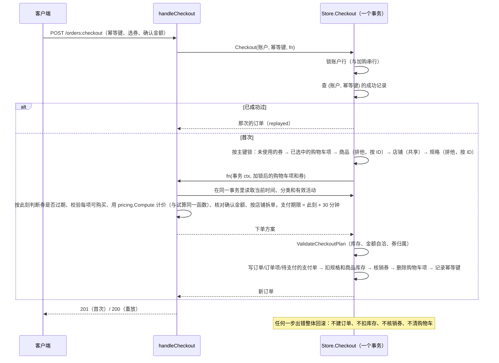

# backend

Go 1.24 标准库 `net/http` API。接口契约见 [openapi.yaml](openapi.yaml)，请求/响应样例见 [fixtures/http/](fixtures/http/)。

```bash
set -a && source ../.env && set +a   # 可选：加载根目录 .env
go run ./cmd/seed                    # 迁移 + 写入演示数据（可重复执行）
go run ./cmd/api                     # http://localhost:8080/api/v1/health
gofmt -l . && go vet ./... && go test ./...

# MySQL / MinIO 集成测试（每个用例自建临时库和临时桶，结束后删除；需要建库权限）
BLINK_TEST_MYSQL_DSN='root:blink_dev_root@tcp(127.0.0.1:3306)/' \
BLINK_TEST_MINIO_ENDPOINT=127.0.0.1:9000 go test ./...
```

未设置 `BLINK_TEST_MYSQL_DSN` / `BLINK_TEST_MINIO_ENDPOINT` 时，本地会跳过对应的集成测试（内存实现的同一套契约测试照常运行）；CI 中会启动 MySQL 和 MinIO 服务并强制运行。MinIO 凭据默认 `minioadmin`，可用 `BLINK_TEST_MINIO_ACCESS_KEY` / `BLINK_TEST_MINIO_SECRET_KEY` 覆盖。

## 数据层

| 位置 | 内容 |
| --- | --- |
| `src/domain` | 领域类型、状态机（`CanTransitionTo`）、定点金额 `Money`/比例 `Rate`、ID 生成。不依赖任何基础设施 |
| `migrations/` | 版本化 SQL 迁移、迁移规则、唯一约束清单和实体关系图，见 [migrations/README.md](migrations/README.md) |
| `src/store` | `Store` 接口与可识别错误：`ErrNotFound`、`ErrConflict`（`ConflictError.Key` 为唯一键名）、`ErrInvalid` |
| `src/store/mysqlstore` | MySQL 实现与迁移执行器；所有 SQL 参数化 |
| `src/store/memstore` | 内存实现，供上层单测使用；实现同样的唯一约束和事务回滚 |
| `src/store/storetest` | 两种实现共用的契约测试 |
| `src/objectstore` | 私有文件的对象存储接口；MinIO 实现与测试用内存实现（可注入写入/读取失败） |
| `src/ingest` | 知识资料入库：清洗（文本/HTML/JSON）、带 SSRF 防护的网页抓取、去重与状态流转 |
| `src/pricing` | 购物车与结算共用的优惠计算（纯函数，金额用分），规则见“营销规则” |
| `src/rag` | 切块、检索词拆分、关键词/向量召回、打分排序和引用（citation）输出 |
| `fixtures/rag/` | 检索评测用的固定语料和问题集（含调参后才加入的 held-out 用例） |
| `src/seed`、`cmd/seed` | 开发演示数据与写入命令 |
| `fixtures/domain/` | 领域对象 JSON 序列化样例；改了领域类型后用 `go test ./src/seed -update` 更新 |

事务通过 context 传递：

```go
err := st.WithTx(ctx, func(ctx context.Context) error {
    // 用同一个 ctx 调用的 Store 方法都在这个事务里；返回 error 或 panic 都会整体回滚。
    // 嵌套 WithTx 复用外层事务。
    return nil
})
```

`Store` 目前只包含本节点需要的方法（账户与资料、登录 token、公开目录查询、事务、种子）；其余方法随各功能节点加入，并同步补充契约测试。

## 演示数据

`go run ./cmd/seed` 先执行迁移，再按固定 ID 写入演示数据：主键已存在的记录跳过，不覆盖本地修改，所以可以重复执行；遇到其他唯一键冲突时整份种子回滚。`APP_ENV=production` 时拒绝运行。

| 账号 | 角色 | 说明 |
| --- | --- | --- |
| `blink_admin` | admin | 平台管理员 |
| `blink_merchant` | merchant | Blink 数码旗舰店 |
| `blink_merchant2` | merchant | Blink 家居生活馆（用于越权测试） |
| `blink_user` | user | 有覆盖全部状态的订单、已用优惠券和评价 |
| `blink_user2` | user | 有一张未使用的优惠券（用于越权测试） |

初始密码均为 `BlinkDev#2026`（仅限本地），数据库只保存 bcrypt 哈希。数据还包括两级分类、9 个商品（可售、库存紧张、无货、下架、风控、已删除）、知识文档与分块、促销规则和优惠券。

## 启动流程

`cmd/api` 的 `run()` 只做组装和生命周期：

1. 读取配置并解析所有 HTTP 配置；任何格式错误直接退出，并一次列出全部问题。
2. `APP_ENV=production` 时做危险配置检查（见下文），不通过则在监听端口前退出（exit 1）。
3. 连接 MySQL。连不上只记 warn，进程照常启动：`/health` 仍为 200，`/ready` 返回 503，MySQL 恢复后自动变回就绪。`RUN_MIGRATIONS` 开启时在后台执行迁移（失败每 5 秒重试）；只要还有未执行的迁移，`/ready` 就是 503。
4. `MINIO_ENDPOINT` 非空时创建 MinIO 客户端（不在启动时连接，第一次上传时按需建桶）；为空时文件接口返回 503 `object_storage_unavailable`，其他功能不受影响。
5. 启动超时订单关闭任务：启动时执行一次，之后每分钟一次（见“订单与支付”）。
6. 监听 `API_ADDR`；收到 SIGINT/SIGTERM 后最多等 10 秒处理完在途请求再退出。

## 中间件链

从外到内依次为：

| 顺序 | 中间件 | 作用 |
| --- | --- | --- |
| 1 | request context | 采用合法的 `X-Request-ID`（1–64 位 `[A-Za-z0-9._-]`），否则生成 24 位 hex；回写响应头；读取本次请求生效的 HTTP 配置 |
| 2 | access log | 每个请求结束后写一条结构化日志（字段见下） |
| 3 | recover | 捕获 panic：日志记录堆栈，客户端只收到 500 `internal_error` |
| 4 | CORS | 按白名单回写 `Access-Control-Allow-Origin`；`OPTIONS` 一律 204 且不进入后续中间件 |
| 5 | IP 限流 | 认证前一层，按客户端 IP 固定窗口计数；超限 429 + `Retry-After` |
| 6 | 请求体限制 | multipart 用 `UPLOAD_MAX_BYTES` + 64 KiB 表单余量，其余用 `HTTP_MAX_BODY_BYTES`；声明长度超限直接 413，未声明长度时读取超限 413 |
| 7 | 超时 | 给 context 设截止时间；handler 超时返回且未写响应时输出 504。`*:stream` 和 `/speech/realtime` 不设超时 |
| 8 | 认证 | 解析 `Authorization: Bearer <token>`，把账户放进 context；只识别不拒绝，是否需要登录由路由的访问规则决定 |
| 9 | 账号限流 | 认证后一层，已登录请求按账号计数；未登录请求只受 IP 层约束 |
| 10 | 路由 | 未知路径 404、方法不支持 405（带 `Allow`），都是统一错误 JSON；命中后先按访问规则检查登录、账户状态和角色 |

`/health`、`/ready` 不参与限流。客户端 IP：只有直连方属于 `TRUSTED_PROXY_CIDRS` 时才读取 `X-Forwarded-For`，并从右往左跳过可信代理，取第一个不可信地址，客户端在头部前面伪造的地址不会被采用。

## 统一错误

失败响应一律为 `{"code": "...", "message": "...", "request_id": "..."}`，`message` 可直接展示，不包含 SQL、堆栈或依赖地址。

| 状态码 | code | 场景 |
| --- | --- | --- |
| 400 | `invalid_json` / `invalid_argument` | JSON 语法错误、空请求体、尾随内容 / 字段类型错误 |
| 400 | `unsupported_file_type` | 上传文件的内容不是允许的类型 |
| 400 | `url_not_allowed` | 采集地址不是 http(s)、带账号密码、端口不允许，或指向内网/保留地址 |
| 401 | `unauthorized` | 未登录，或 token 过期、已登出、伪造 |
| 401 | `invalid_credential` | 登录时账号或密码错误（含用户不存在、已注销） |
| 403 | `forbidden` | 角色不符，或商家操作其他店铺的资源 |
| 403 | `account_inactive` / `account_risk` | 账户状态不允许该操作，见“认证与权限” |
| 404 | `not_found` | 路径不存在 |
| 404 | `file_not_found` | 文件不存在（含记录在但对象已丢失） |
| 404 | `document_not_found` | 知识资料不存在 |
| 409 | `document_processing` | 相同内容的资料正在处理 |
| 409 | `out_of_stock` / `insufficient_stock` / `quantity_limit` / `cart_full` / `item_unavailable` | 加购或改数量：售罄、超过库存、超过单行 99 件、购物车已满 100 种、商品已失效 |
| 409 | `coupon_unavailable` / `coupon_sold_out` / `coupon_limit_reached` | 领券：不在有效期或已停用、已领完、达到每人限领 |
| 404 | `cart_item_not_found` / `coupon_not_found` | 购物车项不存在（含其他人的）/ 券不存在 |
| 400 | `coupon_not_applicable` | 试算时指定的券不能用 |
| 409 | `username_exists` | 注册时用户名已存在 |
| 405 | `method_not_allowed` | 方法不支持 |
| 413 | `payload_too_large` | 请求体或上传文件超限 |
| 415 | `unsupported_media_type` | JSON 接口收到非 `application/json` |
| 429 | `rate_limited` | 触发限流 |
| 500 | `internal_error` | 未预期错误或 panic |
| 500 | `document_index_failed` | 写分块失败，资料已记为 failed，可重新提交 |
| 502 | `source_fetch_failed` | 采集网页抓取失败（超时、非 2xx、过大、类型或编码不支持） |
| 503 | `not_ready` | `/ready` 依赖不可用 |
| 503 | `object_storage_unavailable` | 对象存储未配置或暂时不可用 |
| 504 | `timeout` | 请求处理超时 |

业务 handler 读请求体用 `decodeJSON`，返回错误用 `writeError`：`*APIError` 原样输出，其他 error 一律按 500 处理。

## 公开商品目录

- **可见性**：商品 `active` 且所属商家 `active` 才出现在列表、详情、SKU、评价接口中；下架、风控、已删除、商家停用的商品一律 404 `product_not_found`。无货但上架的商品照常展示。内部的 `Store.GetProduct` 不过滤状态（订单快照、商家后台使用）。
- **搜索**：`store.SearchTerms` 把关键词拆成最多 10 个检索词（完整关键词 + 汉字 2–4 字 n-gram + 字母数字片段），名称、品牌、分类名、标签、卖点包含任一词即命中；MySQL 端用 `LIKE`（转义 `%`/`_`）和 `JSON_SEARCH`，内存实现做同样的不区分大小写匹配，由契约测试保证一致。
- **DTO**：`src/httpapi/catalog.go` 把领域对象转换成公开结构，不输出状态、排序值、内部时间戳，评价不输出账户/订单 ID、评价人名字脱敏；数组字段始终是 `[]`，属性的 `unit` 始终存在。字段集合由 `catalog_test.go` 锁定。
- **促销**：只返回 active、在有效期内、商家营业中的促销；`?product_id=` 只返回适用于该商品的（平台/商家/商品/分类及父分类）。“当前时间”取自 `Options.Now`，测试中固定。
- **演示图片**：`assets/catalog` 下的 PNG 由 `go run ./cmd/gen-sample-images` 生成（纯几何图形、结果确定），编译时内嵌，经 `GET /api/v1/assets/...` 公开读取，种子数据引用这些地址，不需要外网。

## 商家商品管理

- **归属**：merchant_id 一律取自登录账号，请求体里写别的商家 400；读改删其他商家的商品 403（与 RBAC 矩阵一致），不存在或已删除 404。归属与状态检查在 `Store.UpdateProduct` 的行锁回调里做，不会与并发删除交错。
- **规格与派生字段**：SKU 是价格和库存的唯一来源。`domain.Product.SyncFromSKUs` 在每次写库前重算：售价 = 默认规格价格，库存 = 各规格之和，库存状态由数量推导；客户端传的 `stock_status` 忽略。请求可以提交 `skus`（整体替换：带 sku_id 更新、不带新增、未出现删除），或用上游的 `price` + `stock_quantity` 只维护默认规格。
- **状态**：商家只能在 active / inactive 间切换；风控中的商品不能自行上下架（409 `product_under_review`），但能改资料；删除 = 状态改为 deleted（终态，软删）。
- **校验**：失败返回 400 `invalid_argument`，`field` 指出字段（如 `skus[1].price`）。文本默认按单行校验（`checkText`，拒绝换行、制表符和 Unicode 行/段分隔符），只有商品介绍用 `checkMultiline` 允许多行。规则见 `openapi.yaml#/components/schemas/ProductInput`；图片只接受 https 或平台内已存在的图片（内嵌资源）。私有文件（`/files/{id}`）只能由上传者本人读取，不能当作公开的商品图片，因此不接受。
- **审计**：`product.created` / `product.updated` / `product.deleted`。

## 私有文件

- **上传** `POST /files`：multipart 字段 `file`，边接收边写临时文件，同时计算大小和 SHA-256，并用前 512 字节嗅探类型；客户端声明的 Content-Type 和文件名完全不用。允许的类型由 `UPLOAD_ALLOWED_MIME_TYPES` 配置，只能从 JPG/PNG/WebP/GIF/BMP/PDF 中挑选（HTML、SVG 等可执行内容无法放开）；单个文件上限 `UPLOAD_MAX_BYTES`。
- **对象 key**：`uploads/<年>/<月>/<32 位随机 hex>.<扩展名>`（`objectstore.NewObjectKey`），不含账户、文件名等可推测内容，不返回给客户端；`file_id` 为 `file_` + 24 位随机 hex。元数据存 `stored_files`（owner、mime、大小、hash、key）。
- **不留半条记录**：先写对象再写元数据。对象存储未配置 / 写入失败 → 503 `object_storage_unavailable`，不写元数据；元数据写入失败 → 删除刚写入的对象并返回 500。
- **下载** `GET /files/{id}`：只有上传者本人和管理员可读，其他账号 403（先查归属再访问存储，存储不可用时越权请求仍是 403）。响应使用上传时嗅探出的类型，带 `nosniff`、`Content-Security-Policy: default-src 'none'; sandbox`，图片 inline、PDF attachment，`Cache-Control: private`，`ETag` 为内容 hash，支持 `If-None-Match` → 304。目前没有缩略图接口；预览也走同一个需要登录的地址。
- **审计**：`file.uploaded`（file_id、类型、大小，不记录 object key）。

## 知识文档与检索

接口：商家 `GET,POST /merchant/documents`、`GET /merchant/documents/{id}`、`POST /merchant/unstructured-ingestions`；管理员 `GET /admin/documents`、`GET /admin/documents/{id}`、`POST /admin/unstructured-ingestions`。商家只能看和提交自己的资料（其他商家和平台资料 403）；管理员看全部，可以为任意商家或平台（`merchant_id` 为空）采集。平台资料不能关联商品。

**入库流程**（`ingest.Service.Ingest`）：

1. 取得内容：`content` / `html` / `json_text` / `source_url` 四选一。网页由服务端抓取：只允许 http(s) 和 80/443/8080/8443 端口，URL 不能带账号密码；拨号时检查实际连接的 IP（重定向和 DNS 重绑定同样受检），拒绝回环、内网、链路本地、组播、运营商 NAT、NAT64、文档保留段和云元数据地址；不走环境代理；最多 3 次重定向；8 秒超时、2MB 上限；只接受 UTF-8 的网页、JSON、纯文本：声明了其他编码，或正文含非法 UTF-8 字节（无论是否声明 charset）都按抓取失败处理（502），不会删改字节后入库。
2. 清洗为纯文本：统一换行、去掉控制字符和零宽字符、压缩空白、连续空行合并为一个（段落分隔）。HTML 用分词器解析，跳过 script/style/noscript/template/head/svg/iframe/nav 等，块级元素换行；JSON 展开为“路径: 值”，对象键按名称排序（上游按 map 随机顺序，同一份 JSON 每次 hash 不同，去重失效），顶层数组的记录之间空一行。超过 120000 字截断。
3. 去重：同一商家（平台算一个“商家”）清洗后正文的 SHA-256 相同 → 已索引的直接返回（200，`duplicate`）；`force_reindex` 或此前失败的文档 → 用本次的标题、类型、商品和元数据重新处理同一篇文档；正在处理 → 409；处理中超过 10 分钟视为中断，先记为失败再重新处理。并发提交同样内容只会建一篇文档（唯一键 `(merchant_id, content_hash)`）。
4. 状态：新文档 `uploaded` → `parsing`（切块）→ `indexing`（写分块，同一事务改为 `indexed`）→ 建向量索引。写分块失败 → `failed` 并记录原因，返回 500 `document_index_failed`。向量索引失败只记日志，文档仍为 `indexed`（关键词检索可用）。所有状态变化都经 `DocumentStatus` 状态机校验。
5. 审计：`knowledge.ingested` / `knowledge.duplicate`。

**分块策略**（`rag.Split`，每块不超过 800 字）：

- 按空行分段，相邻段落合并到不超过 800 字；
- 单个段落超长时在句末标点（。！？；!?; 和换行）处切句，再不行按逗号、顿号切，句子打包成块，相邻块重叠上一块末尾约 100 字；单句仍超长时按 800 字硬切，同样重叠 100 字；
- `faq` 类型：以“问：/问题：/Q:”开头的行开始一个问答块（块标题为问题），第一个问题之前的内容按普通段落切；
- 分块标题默认是文档标题，来源（source）是文档标题。

**检索**（`rag.Retriever.Search`，供导购 Agent 使用，暂无独立 HTTP 接口）：

- 检索词（`rag.QueryTerms`）：汉字按相邻两字切分，含语气词的二元组丢弃，“多少”“可以”等提问用语权重 0.2；字母数字片段（型号、品牌、单位）整体作为一个词，权重 2；最多 24 个。
- 关键词召回：任一词出现在分块标题、正文或文档标题中；只召回已索引、商家营业中（或平台资料）、关联商品（如有）公开可见的分块；命中词多的优先，最多 200 个。
- 打分：每个词的权重乘以候选集内的区分度 `ln(1 + N/df)`（所有候选都有的词权重最低；候选中都没出现的词多为跨词边界的无意义片段，按 0.3 折扣计入）。关键词分 = 0.7 × 命中权重占比 + 0.15 × 标题命中占比 + 0.15 × 是否包含完整问题。
- 向量（`rag.VectorIndex`，Milvus 在 8.2 接入）：配置后取前 50 个相似分块，经 Store 按同样的可见性和过滤条件取回（已删除、下架、被过滤的向量结果丢弃），最终分 = 0.65 × 关键词分 + 0.35 × 相似度；向量检索失败时记日志并回退关键词（`Result.VectorError`）。
- 低于 0.2 分的不返回；按分数降序、chunk_id 升序取前 5（最多 20）；摘要截取第一个命中词附近的 160 字。
- 引用字段：chunk_id、document_id、merchant_id、product_id、title（分块标题）、document_title、snippet、source、source_url、score、matched_by。
- 评测：`TestRecallOnFixedCorpus` 用 `fixtures/rag/` 的 13 篇语料 + 种子资料、34 个问题（其中 12 个是调参之后才加入的 held-out），在内存和 MySQL 两种 Store 上要求 recall@3 = 1.0，并核对首条引用的文档、商品、来源和摘要。

## 购物车与优惠券

接口（仅普通用户，商家和管理员 403）：`GET /cart`、`GET /cart/discount-preview`、`POST /cart/items`、`PATCH,DELETE /cart/items/{id}`、`GET /coupons/available`、`GET /coupons/mine`、`POST /coupons/{id}:claim`。购物车的写操作返回整个购物车（与上游一致），金额全部由服务端计算。

- **加购**：商品必须公开可见；不传 sku_id 用默认规格；`(账户, 商品, 规格)` 唯一，再次加购累加数量并重新选中。MySQL 实现先锁定账户行（同一账户的加购串行执行，锁序唯一），再锁定该购物车行由回调计算新数量，并发加购不会产生重复行、丢失数量或死锁（只锁购物车行时，对不存在的行各自拿到间隙锁后互相等待 INSERT，30 路并发会死锁约 95 次）；唯一键冲突或死锁仍兜底重试最多 3 次，`TestConcurrentAddCartNoDeadlock` 断言正常并发下重试次数为 0。累加后不超过库存和单行 99 件；最多 100 种商品。
- **数量与状态**：数量只能是 1–99 的整数且不超过当前库存（0/负数/小数 400，超库存 409，不把 0 当删除）。只能操作本人的购物车项，其他人的按不存在处理（404，不暴露是否存在）。
- **失效商品**：商品下架/删除/店铺停业、规格失效、售罄或数量超过库存时 `available=false` 并给出原因，不参与计价；修改按更新后的状态判断：改数量或更新后为选中时，商品必须可以购买且数量不超过库存。判断用的商品、店铺、规格状态由 Store 在锁定购物车行的同一事务里重新读取并加共享锁（`FOR SHARE`），加购同理：商家修改商品的事务（对商品行加排他锁）要么已提交、在这里读到新状态，要么等购物车事务结束，不会按过期状态放行；锁顺序固定为 账户 → 购物车行 → 商品 → 店铺 → 规格，修改商品的事务不锁购物车，不会形成环（`CartUpdateWaitsForProductChange` / `ProductChangeWaitsForCartUpdate` / `CartAndProductLockOrderNoDeadlock` 覆盖）。所以不可购买的项不能被选中，只能取消选中、删除，库存不足的可以把数量改到库存以内（可同时选中）。不可购买的项在购物车中显示为未选中，保存的选择不变，商品恢复后回到原状态。
- **领券**：锁定券行后检查 active、有效期 `[start_at, end_at)`、店铺营业中、总量（0 为不限）、每人限领（`per_user_limit` 小于 1 时按 1），然后写领取记录并加已领数。并发领取不超发。“我的券”按当前时间计算状态，未使用但已到期的显示 expired。
- **审计**：`cart.item_added` / `cart.item_updated` / `cart.item_removed` / `coupon.claimed`。

## 营销规则

计算在 `pricing.Compute`（纯函数，金额以分为单位的 `domain.Money`），购物车、试算和下单共用（`pricingContext.price`）。只有已选中且可购买的购物车项参与。

| # | 规则 |
| --- | --- |
| 1 | 有效：活动/券为 active，且在 `[start_at, end_at)` 内；店铺的活动/券要求店铺营业中（由 Store 过滤） |
| 2 | 范围：platform 全部商品；merchant 该店铺商品；product 该商品；category 该分类及其子分类的商品。活动带 merchant_id 时只作用于该店铺的商品 |
| 3 | 顺序：活动按 单品 → 品类 → 店铺 → 平台 依次计算；同一层级每次选“当前优惠最大”的活动（相同时按 ID），直到没有可用活动 |
| 4 | 基数与门槛：基数是范围内商品的当前金额（已减去前面的优惠）；基数 ≥ 门槛才生效（门槛 0 表示无门槛） |
| 5 | 满减（full_reduction）：优惠 = min(减额, 基数) |
| 6 | 折扣（discount）：`discount_rate` 是实付比例（0.95 = 9.5 折）；优惠 = 基数 − round(基数 × 比例)，四舍五入到分。上游把比例当作优惠比例（9.5 折会变成减 95%），这里按“折”的含义修正 |
| 7 | 叠加：stackable=false 的活动只作用于还没参加过任何活动的商品；生效后这些商品不再参加后续活动，也不能用券 |
| 8 | 分摊：每条优惠按商品当前金额比例分摊到分（向下取整，余数按最大余数法分配），单个商品的优惠不超过其金额，实付不会为负 |
| 9 | 用券：活动之后计算；每个店铺最多一张店铺券、整单最多一张平台券；先店铺券后平台券，门槛按用券前的当前金额判断；券只有满减（fixed_amount） |
| 10 | 选券：不指定时每个范围自动选优惠最大的一张（相同时先用快到期的）；指定 `user_coupon_ids` 时只用这些券，任何一张不能用都返回 400（不悄悄忽略），空值表示不用券 |
| 11 | 凑单提示：满减门槛没达到时返回差额（hints） |

上游实现的差异：上游把所有有效活动都按整单金额累加（不看单品/品类范围和 stackable），所有未使用的券同时使用，金额用 float 计算。这些都按上表修正。不变量（明细之和 = 分摊之和 = 总优惠、实付不为负、店铺小计相加等于整单、结果与活动/券的输入顺序无关）由 `TestRandomInvariants` 对 2000 组随机购物车验证。

## 订单与支付

接口：用户 `GET /orders`、`POST /orders:checkout`、`GET /orders/{id}`、`POST /orders/{id}:pay | :cancel | :confirm-receipt`、`POST /orders/{id}/items/{item_id}:review`；
商家 `GET /merchant/orders`、`GET,PATCH /merchant/orders/{id}`；管理员 `GET /admin/orders`、`GET,PATCH /admin/orders/{id}`。路径与上游一致（动作写在路径段内）。

### 状态机

```text
订单：pending_payment ──支付──▶ paid ──商家/管理员发货──▶ shipped ──用户确认收货──▶ completed
          │
          └──用户取消 / 管理员取消 / 超时关闭──▶ cancelled（库存回补、退券）
支付单：pending ──▶ paid | closed
```

- 只有服务端能改状态，全部经过 `store.CheckOrderUpdate`：订单和支付单的变化必须符合状态机，且两者同步（已支付/已发货/已完成的订单必须有已支付的支付单，取消的订单不能有）；订单的归属、金额、编号不能改。
- 谁能做什么：用户只能支付、取消自己待支付的订单，确认自己已发货的订单，评价自己已完成订单里的商品（每件一次）；商家只能把本店已支付的订单改为已发货；管理员可以代发货，或取消待支付订单。已支付的订单任何人都不能取消（退款不在本节点范围）。
- 别人的订单（他人、他店）一律 404 `order_not_found`，不暴露是否存在（与上游商家接口一致）。状态不允许返回 409 `order_status_conflict`。

### 结算事务

`POST /orders:checkout` 只结算购物车中已选中的商品，按店铺拆单。幂等键必填（`Idempotency-Key` 头或 `idempotency_key` 字段）：同一账户同一个键成功下单后，再次请求返回那次的订单（200，`replayed=true`）；失败的请求不占用键。可选 `expected_pay_amount`：与重新计算的实付金额不同时 409 `price_changed`，防止用户按过期的金额下单。



- **并发**：所有行都按主键加锁，不做范围加锁。范围锁会在唯一索引上留下间隙锁，挡住其他账户加购时的插入，而加购事务已持有商品共享锁，结算随后要商品排他锁，就会死锁（实测出现过）。各事务的锁顺序：结算“账户 → 用户券 → 购物车行 → 商品 → 店铺 → 规格”；加购“账户 → 购物车行 → 商品 → 店铺 → 规格”；改购物车“购物车行 → 商品 → 店铺 → 规格”；商家改商品“商品 → 规格”；订单状态变化“结算请求 → 订单 → 支付单 → 用户券 → 商品 → 规格”，彼此不形成环。`TestConcurrentTradeNoDeadlock` 让 20 个账户按不同顺序结算同一批商品，同时取消 10 个订单、商家修改这些商品、继续加购，断言没有死锁重试，最终库存精确等于“初始 − 未取消订单件数”。
- **库存**：规格库存用 `UPDATE … SET stock_quantity = stock_quantity + ? WHERE … AND stock_quantity + ? >= 0` 增减，商品库存按同样的增量调整（保持 = 各规格之和），库存状态在同一条语句里重算；基于最新提交的值，不依赖事务开始时的快照。8 个用户同时抢 5 件库存，恰好 5 单成功，库存为 0。
- **订单内容**：订单项冻结下单时的商品名称、规格名、图片和单价，按购物车中的顺序排列；每个订单的优惠 = 活动和券分摊到本店商品的部分（与试算的店铺小计一致）。订单号 `BS + 下单时间(UTC) + 6 位随机数字`，撞号时整体重试。
- **券**：店铺券只能用在本店订单上；平台券可以分摊到多个店铺的订单，记录在第一个订单上。
- **时间与计价数据在事务内读取**：当前时间、分类和有效活动都在 fn 里用事务的 ctx 读取（已持有账户、购物车、库存和券的锁之后），券是否过期也按这个时间判断。排队等锁再久，订单也按此刻生效的活动计价；MySQL 的一致性读快照建立在持有账户锁之后的第一次读取，等锁期间已提交的活动变化都能读到。
- **支付期限**：从订单在事务内创建的时刻起 30 分钟（`Options.PaymentTimeout`），不受排队等锁的时间影响。

### 支付、取消与超时

- 模拟支付 `:pay`：`method` 为 `mock_balance`（默认）/ `mock_wechat` / `mock_alipay`；订单变为 paid，支付单 paid、记录流水号（`MOCK` + 20 位十六进制）。
- 取消（用户 `:cancel`、管理员 `PATCH status=cancelled`、超时关闭）在同一事务内：支付单关闭 → 退券（店铺券直接退；平台券在同一次结算的订单全部取消后才退，判断兄弟订单状态时先锁结算请求行，这些订单的状态变化在那里串行）→ 把订单项数量加回仍存在的规格。同一订单重复取消不会重复回补。
- 超时：`RunOrderCloser` 每分钟找出已过期限的待支付订单（每批 100 个），逐个在订单行锁内再次确认后关闭，原因“支付超时自动关闭”；支付接口发现超时也会顺带关闭并返回 409 `order_expired`。两处都在行锁内判断，不会重复关闭。

### 评价

`POST /orders/{id}/items/{item_id}:review`：评分 1–5，内容去首尾空白后 1–500 字，标签去空白和重复后最多 5 个、每个最多 20 字；订单必须已完成；每个订单项只能评价一次（唯一键 `uk_product_reviews_order_item`）。评价立即公开（visible）。商家回复和管理员隐藏评价在 5.2 / 5.3。

### 审计

`order.checkout`、`order.paid`、`order.cancelled`（by user/admin）、`order.closed`（reason payment_timeout，by system 或支付时发现）、`order.shipped`、`order.completed`、`review.created`。

### 与上游的差异

| 上游 | 这里 |
| --- | --- |
| 结算不读请求体，没有幂等（双击会下两单，只靠购物车行被删除挡住） | 幂等键必填，重放返回首次订单 |
| 下单不计算活动和券，`discount_amount` 恒为 0，券永远不核销 | 与试算同一套计价，券在下单时核销 |
| 选中但已下架的商品被悄悄跳过，却照样从购物车删除 | 选中的商品有任何一件不可购买就整单失败（409 `item_unavailable`） |
| 取消、超时都不回补库存 | 回补库存、退券 |
| 超时只在查询订单时顺带关闭 | 后台每分钟关闭，支付时也会检查 |
| 订单状态多了 `pending_ship`、`closed_timeout`、`refund_requested`、`refunded`；商家/管理员可以把 pending_ship/shipped 的订单改成其中任意状态 | 按 docs/02 的状态机（paid 即待发货，超时关闭也是 cancelled）；商家只能发货，管理员只能发货或取消待支付订单 |
| 各种失败统一返回 `empty_cart` / `pay_failed` / `cancel_failed` / `review_failed` | 按原因给出不同的错误码（见 OpenAPI） |
| 未设置的时间输出 `0001-01-01T00:00:00Z` | 输出 `null` |
| 评价内容和标签没有长度限制 | 内容 ≤500 字，标签 ≤5 个、每个 ≤20 字 |

## 认证与权限

- **token**：注册/登录返回 32 字节随机 token（base64url），`auth_tokens` 只存 SHA-256 摘要和过期时间。每个请求都按 token 重新读取账户，所以管理员改账户状态立即生效。登出撤销当前 token，注销撤销全部 token。
- **密码**：bcrypt（`DefaultCost`）。兼容上游遗留的 SHA-256 hex 哈希，登录成功后自动升级；bcrypt 成本低于当前设置时同样升级。用户不存在时也做一次 bcrypt 比较，避免按响应时间枚举用户名。
- **审计**：注册、登录成功/失败/被拒、登出、改资料、改联系方式、上传头像、上传文件、注销、密码升级都写一条 `msg=audit` 日志，只含动作和 ID，不含密码、token、手机号、邮箱。
- **头像**：`POST /uploads/avatar` 按内容嗅探（JPG/PNG/WebP，≤2MB），文件名为 `<account_id>_<随机 16 位 hex>.<ext>`；`PATCH /account/profile` 只接受本人上传且仍存在的头像地址。读取接口公开，经 `os.Root` 限定在头像目录内。

### 路由访问规则

每条路由注册时必须用 `s.handle(pattern, access, handler)` 指定规则（`src/httpapi/auth.go`）：

| 规则 | 需要登录 | 允许角色 | inactive | risk |
| --- | --- | --- | --- | --- |
| `public` | 否 | 任何人 | — | — |
| `session` | 是 | user / merchant / admin | 允许 | 允许 |
| `account` | 是 | user / merchant / admin | 403 `account_inactive` | 只读，写操作 403 `account_risk` |
| `user` | 是 | user | 403 `account_inactive` | 只读，写操作 403 `account_risk` |
| `merchant` | 是 | merchant（且已关联店铺） | 403 `account_inactive` | 只读，写操作 403 `account_risk` |
| `admin` | 是 | admin | 403 `account_inactive` | 只读，写操作 403 `account_risk` |

检查顺序：未登录 401 → 账户状态 403 → 角色 403。inactive/risk 账户不能新登录（密码正确时返回对应 403）；已注销账户的 token 全部删除，等同未登录。商家与管理员共用的资源接口，在角色检查之后还要调用 `requireMerchantOwner`：商家只能操作 `merchant_id` 与自己一致的资源，管理员不受限。

### RBAC 矩阵

当前全部路由（`TestRouteAccessTable` 保证与代码一致，新增路由必须同时更新这里和测试）：

| 路由 | 规则 |
| --- | --- |
| `GET /health`、`GET /ready` | public |
| `POST /auth/register`、`POST /auth/login` | public |
| `POST /auth/logout`、`GET /auth/me` | session |
| `GET,PATCH /account/profile`、`PATCH /account/contact`、`DELETE /account` | account |
| `POST /uploads/avatar` | account |
| `GET /uploads/avatar/{name}` | public |
| `GET /categories/tree`、`GET /merchants`、`GET /products`、`GET /products/{id}`、`GET /products/{id}/skus`、`GET /products/{id}/reviews`、`GET /promotions` | public |
| `GET /assets/{path...}` | public |
| `GET /cart`、`GET /cart/discount-preview`、`POST /cart/items`、`PATCH,DELETE /cart/items/{id}`、`GET /coupons/available`、`GET /coupons/mine`、`POST /coupons/{id}:claim` | user（购物车项另按账户限定） |
| `GET /orders`、`POST /orders:checkout`、`GET /orders/{id}`、`POST /orders/{id}:pay`、`:cancel`、`:confirm-receipt`、`POST /orders/{id}/items/{item_id}:review` | user（订单另按账户限定，他人订单 404） |
| `POST /files`、`GET /files/{id}` | account（下载另做本人/管理员校验） |
| `GET,POST /merchant/products`、`GET,PATCH,DELETE /merchant/products/{id}` | merchant（另做归属校验） |
| `GET,POST /merchant/documents`、`GET /merchant/documents/{id}`、`POST /merchant/unstructured-ingestions` | merchant（另做归属校验） |
| `GET /merchant/orders`、`GET,PATCH /merchant/orders/{id}` | merchant（只看本店订单，他店订单 404） |
| `GET /admin/documents`、`GET /admin/documents/{id}`、`POST /admin/unstructured-ingestions` | admin |
| `GET /admin/orders`、`GET,PATCH /admin/orders/{id}` | admin |

后续节点按前缀约定（`TestRoutePrefixRoles` 检查）：`/admin/*` → admin；`/merchant/*` → merchant；`/cart`、`/orders`、`/coupons/*`、`/agent/*`、`/speech/*` → user；`/files` → account；分类/商家/商品读取 → public。

| 场景 | 预期 |
| --- | --- |
| 未登录访问任何非 public 路由 | 401 `unauthorized` |
| user / merchant 访问 admin 路由 | 403 `forbidden` |
| merchant / admin 访问 user 交易路由 | 403 `forbidden` |
| merchant 修改其他店铺资源 | 403 `forbidden` |
| inactive 用户写交易 | 403 `account_inactive` |
| risk 用户写交易 | 403 `account_risk` |

## 配置

读取优先级：**环境变量 → 动态配置（Nacos/内存）→ 内置默认值**，空字符串视为未设置。动态配置目前只有内存实现，Nacos 在 9.1 接入。HTTP 配置每个请求重新读取，所以运行中修改动态配置会立即生效；动态配置写成非法值时，该项退回内置默认值，不会停服。

| 环境变量 | 动态配置键 | 默认值 | 说明 |
| --- | --- | --- | --- |
| `APP_ENV` | — | `development` | `development` / `test` / `production`（`prod`） |
| `API_ADDR` | — | `:8080` | 监听地址 |
| `RUN_MIGRATIONS` | — | 非生产 `true`，生产 `false` | 启动时在后台执行数据库迁移 |
| `BOOTSTRAP_VECTOR_INDEX` | — | 非生产 `true`，生产 `false` | 启动时初始化向量索引（8.x 实现） |
| `MYSQL_DSN` | — | 与 Compose 开发库一致 | 密钥类，日志中整体掩码。连接时强制 UTC 时区、`parseTime`、utf8mb4 |
| `CORS_ALLOWED_ORIGINS` | `http.cors.allowed_origins` | `*` | 逗号分隔；生产环境始终忽略 `*` |
| `TRUSTED_PROXY_CIDRS` | `http.trusted_proxy_cidrs` | 空 | 逗号分隔的 CIDR 或 IP |
| `TRUST_ALL_PROXIES` | `http.trust_all_proxies` | `false` | 仅本地调试；生产始终视为 `false` |
| `HTTP_MAX_BODY_BYTES` | `http.max_body_bytes` | `1048576` | JSON 请求体上限 |
| `UPLOAD_MAX_BYTES` | `http.upload_max_bytes` | `10485760` | 单个上传文件上限（multipart 请求体另留 64 KiB 余量） |
| `UPLOAD_ALLOWED_MIME_TYPES` | `files.allowed_mime_types` | `image/jpeg,image/png,image/webp,image/gif,application/pdf` | `POST /files` 允许的类型，只能从 JPG/PNG/WebP/GIF/BMP/PDF 中选；含其他值时整项退回默认 |
| `HTTP_REQUEST_TIMEOUT` | `http.request_timeout` | `30s` | 非流式请求超时 |
| `RATE_LIMIT_IP_PER_MINUTE` | `http.rate_limit.ip_per_minute` | `120` | 认证前 IP 限额 |
| `RATE_LIMIT_ACCOUNT_PER_MINUTE` | `http.rate_limit.account_per_minute` | `120` | 认证后账号限额 |
| `AUTH_TOKEN_TTL` | `auth.token_ttl` | `24h` | 登录 token 有效期（与上游一致） |
| `LOGIN_ATTEMPTS_PER_MINUTE` | `auth.login_attempts_per_minute` | `10` | 同一用户名每分钟登录尝试上限 |
| `AVATAR_UPLOAD_DIR` | — | `uploads/avatar` | 头像文件目录（相对启动目录）。头像公开读取，与上游一致存本地，不进私有文件存储 |
| `MINIO_ENDPOINT` | — | 空 | 对象存储地址（如 `127.0.0.1:9000`，不带协议）；为空表示未配置，文件接口返回 503 |
| `MINIO_BUCKET` | — | `blink-shop` | 桶名（S3 命名规则），不存在时首次上传自动创建 |
| `MINIO_USE_SSL` | — | `false` | 是否用 HTTPS 连接对象存储 |
| `MINIO_ACCESS_KEY` / `MINIO_SECRET_KEY` | — | `minioadmin` | 密钥类 |
| `MILVUS_TOKEN` | — | 空 | 密钥类 |
| `AI_API_KEY` | — | 空 | 密钥类 |

### 生产危险配置

`APP_ENV=production` 时，以下任一情况都会拒绝启动：

- `MYSQL_DSN` 无法解析，或密码为空 / `root` / `password` / `123456` / `blink_dev_password` / `blink_dev_root`；
- `CORS_ALLOWED_ORIGINS` 为空或包含 `*`；
- `MINIO_ACCESS_KEY` 或 `MINIO_SECRET_KEY` 为空或 `minioadmin`；
- `MILVUS_TOKEN` 为空或 `root:Milvus`；
- `AI_API_KEY` 为空或示例值（`changeme`、`your-api-key`、`sk-xxx`）；
- `TRUST_ALL_PROXIES` 开启。

错误信息只列出配置名，不回显配置值。

## 日志

所有日志都是 JSON 单行，写到 stdout；MySQL 驱动自身的日志也转到这里。

访问日志（`msg = "http request"`），5xx 为 `ERROR` 级别，其余为 `INFO`：

| 字段 | 说明 |
| --- | --- |
| `time` / `level` / `msg` | slog 标准字段 |
| `request_id` | 与响应头 `X-Request-ID` 一致 |
| `method` / `path` | 不记录 query string，避免 token 等参数落盘 |
| `status` | 最终状态码；handler 未写任何内容时记为 200 |
| `bytes` | 响应体字节数 |
| `duration_ms` | 处理耗时（毫秒） |
| `client_ip` | 按可信代理规则得到的客户端 IP |
| `user_agent` | 请求的 User-Agent |
| `account_id` | 已登录时出现 |

审计事件：`audit`，字段 `action`（如 `auth.login`、`auth.login_failed`、`account.deleted`）、`account_id`、`client_ip`，见“认证与权限”。

其他事件：`auth lookup failed`、`register failed`、`login lookup failed`、`create token failed`、`password rehash failed`、`account update failed`、`delete account failed`、`save avatar failed`、`config loaded`、`api listening`、`mysql unavailable at startup`、`readiness check failed`、`panic recovered`（含 `stack`）、`mysql driver`、`database migrated`、`database migration failed, will retry`、`api shutdown completed`。

### 脱敏规则

由 `src/logging` 在写出前统一处理，覆盖消息正文、所有字段（包括 `With` 和分组里的字段）、error 值，以及作为字段值传入的结构体、map、切片（按 JSON 结构递归处理）：

- 字段名包含 `authorization`、`password`、`passwd`、`token`、`secret`、`apikey`/`api_key`、`cookie`、`dsn`、`credential`（忽略大小写、`_`、`-`、`.`），值整体替换为 `***`；
- 任意字符串中的大陆手机号保留前 3 位和后 4 位（`138****5678`，支持 `+86` 前缀）；
- 邮箱保留首字符和域名（`a***@example.com`）；
- `Bearer <token>` 替换为 `Bearer ***`。
