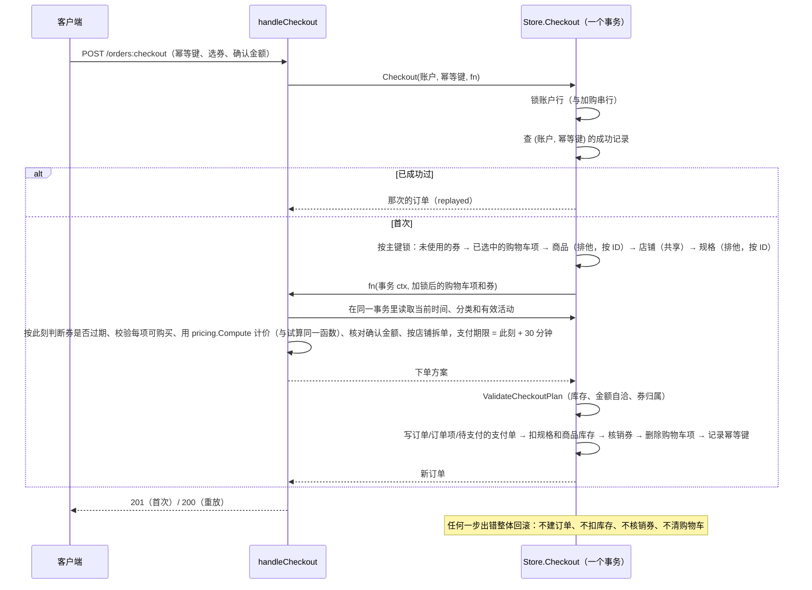

# backend

Go 1.24 标准库 `net/http` API。接口契约见 [openapi.yaml](openapi.yaml)，请求/响应样例见 [fixtures/http/](fixtures/http/)。

```bash
set -a && source ../.env && set +a   # 可选：加载根目录 .env
go run ./cmd/seed                    # 迁移 + 写入演示数据（可重复执行）
go run ./cmd/api                     # http://localhost:8080/api/v1/health
gofmt -l . && go vet ./... && go test ./...

# MySQL / MinIO 集成测试（每个用例自建临时库和临时桶，结束后删除；需要建库权限）
BLINK_TEST_MYSQL_DSN='root:blink_dev_root@tcp(127.0.0.1:3306)/' \
BLINK_TEST_MINIO_ENDPOINT=127.0.0.1:9000 go test ./...
```

未设置 `BLINK_TEST_MYSQL_DSN` / `BLINK_TEST_MINIO_ENDPOINT` 时，本地会跳过对应的集成测试（内存实现的同一套契约测试照常运行）；CI 中会启动 MySQL 和 MinIO 服务并强制运行。MinIO 凭据默认 `minioadmin`，可用 `BLINK_TEST_MINIO_ACCESS_KEY` / `BLINK_TEST_MINIO_SECRET_KEY` 覆盖。

## 数据层

| 位置 | 内容 |
| --- | --- |
| `src/domain` | 领域类型、状态机（`CanTransitionTo`）、定点金额 `Money`/比例 `Rate`、ID 生成。不依赖任何基础设施 |
| `migrations/` | 版本化 SQL 迁移、迁移规则、唯一约束清单和实体关系图，见 [migrations/README.md](migrations/README.md) |
| `src/store` | `Store` 接口与可识别错误：`ErrNotFound`、`ErrConflict`（`ConflictError.Key` 为唯一键名）、`ErrInvalid` |
| `src/store/mysqlstore` | MySQL 实现与迁移执行器；所有 SQL 参数化 |
| `src/store/memstore` | 内存实现，供上层单测使用；实现同样的唯一约束和事务回滚 |
| `src/store/storetest` | 两种实现共用的契约测试 |
| `src/objectstore` | 私有文件的对象存储接口；MinIO 实现与测试用内存实现（可注入写入/读取失败） |
| `src/ingest` | 知识资料入库：清洗（文本/HTML/JSON）、带 SSRF 防护的网页抓取、去重与状态流转 |
| `src/pricing` | 购物车与结算共用的优惠计算（纯函数，金额用分），规则见“营销规则” |
| `src/rag` | 切块、检索词拆分、关键词/向量召回、打分排序和引用（citation）输出 |
| `fixtures/rag/` | 检索评测用的固定语料和问题集（含调参后才加入的 held-out 用例） |
| `src/seed`、`cmd/seed` | 开发演示数据与写入命令 |
| `fixtures/domain/` | 领域对象 JSON 序列化样例；改了领域类型后用 `go test ./src/seed -update` 更新 |

事务通过 context 传递：

```go
err := st.WithTx(ctx, func(ctx context.Context) error {
    // 用同一个 ctx 调用的 Store 方法都在这个事务里；返回 error 或 panic 都会整体回滚。
    // 嵌套 WithTx 复用外层事务。
    return nil
})
```

`Store` 目前只包含本节点需要的方法（账户与资料、登录 token、公开目录查询、事务、种子）；其余方法随各功能节点加入，并同步补充契约测试。

## 演示数据

`go run ./cmd/seed` 先执行迁移，再按固定 ID 写入演示数据：主键已存在的记录跳过，不覆盖本地修改，所以可以重复执行；遇到其他唯一键冲突时整份种子回滚。`APP_ENV=production` 时拒绝运行。

| 账号 | 角色 | 说明 |
| --- | --- | --- |
| `blink_admin` | admin | 平台管理员 |
| `blink_merchant` | merchant | Blink 数码旗舰店 |
| `blink_merchant2` | merchant | Blink 家居生活馆（用于越权测试） |
| `blink_user` | user | 有覆盖全部状态的订单、已用优惠券和评价 |
| `blink_user2` | user | 有一张未使用的优惠券（用于越权测试） |

初始密码均为 `BlinkDev#2026`（仅限本地），数据库只保存 bcrypt 哈希。数据还包括两级分类、9 个商品（可售、库存紧张、无货、下架、风控、已删除）、知识文档与分块、促销规则和优惠券。

## 启动流程

`cmd/api` 的 `run()` 只做组装和生命周期：

1. 读取配置并解析所有 HTTP 配置；任何格式错误直接退出，并一次列出全部问题。
2. `APP_ENV=production` 时做危险配置检查（见下文），不通过则在监听端口前退出（exit 1）。
3. 连接 MySQL。连不上只记 warn，进程照常启动：`/health` 仍为 200，`/ready` 返回 503，MySQL 恢复后自动变回就绪。`RUN_MIGRATIONS` 开启时在后台执行迁移（失败每 5 秒重试）；只要还有未执行的迁移，`/ready` 就是 503。
4. `MINIO_ENDPOINT` 非空时创建 MinIO 客户端（不在启动时连接，第一次上传时按需建桶）；为空时文件接口返回 503 `object_storage_unavailable`，其他功能不受影响。
5. 启动超时订单关闭任务：启动时执行一次，之后每分钟一次（见“订单与支付”）。
6. 监听 `API_ADDR`；收到 SIGINT/SIGTERM 后最多等 10 秒处理完在途请求再退出。

## 中间件链

从外到内依次为：

| 顺序 | 中间件 | 作用 |
| --- | --- | --- |
| 1 | request context | 采用合法的 `X-Request-ID`（1–64 位 `[A-Za-z0-9._-]`），否则生成 24 位 hex；回写响应头；读取本次请求生效的 HTTP 配置 |
| 2 | access log | 每个请求结束后写一条结构化日志（字段见下） |
| 3 | recover | 捕获 panic：日志记录堆栈，客户端只收到 500 `internal_error` |
| 4 | CORS | 按白名单回写 `Access-Control-Allow-Origin`；`OPTIONS` 一律 204 且不进入后续中间件 |
| 5 | IP 限流 | 认证前一层，按客户端 IP 固定窗口计数；超限 429 + `Retry-After` |
| 6 | 请求体限制 | multipart 用 `UPLOAD_MAX_BYTES` + 64 KiB 表单余量，其余用 `HTTP_MAX_BODY_BYTES`；声明长度超限直接 413，未声明长度时读取超限 413 |
| 7 | 超时 | 给 context 设截止时间；handler 超时返回且未写响应时输出 504。`*:stream` 和 `/speech/realtime` 不设超时 |
| 8 | 认证 | 解析 `Authorization: Bearer <token>`，把账户放进 context；只识别不拒绝，是否需要登录由路由的访问规则决定 |
| 9 | 账号限流 | 认证后一层，已登录请求按账号计数；未登录请求只受 IP 层约束 |
| 10 | 路由 | 未知路径 404、方法不支持 405（带 `Allow`），都是统一错误 JSON；命中后先按访问规则检查登录、账户状态和角色 |

`/health`、`/ready` 不参与限流。客户端 IP：只有直连方属于 `TRUSTED_PROXY_CIDRS` 时才读取 `X-Forwarded-For`，并从右往左跳过可信代理，取第一个不可信地址，客户端在头部前面伪造的地址不会被采用。

## 统一错误

失败响应一律为 `{"code": "...", "message": "...", "request_id": "..."}`，`message` 可直接展示，不包含 SQL、堆栈或依赖地址。

| 状态码 | code | 场景 |
| --- | --- | --- |
| 400 | `invalid_json` / `invalid_argument` | JSON 语法错误、空请求体、尾随内容 / 字段类型错误 |
| 400 | `unsupported_file_type` | 上传文件的内容不是允许的类型 |
| 400 | `url_not_allowed` | 采集地址不是 http(s)、带账号密码、端口不允许，或指向内网/保留地址 |
| 401 | `unauthorized` | 未登录，或 token 过期、已登出、伪造 |
| 401 | `invalid_credential` | 登录时账号或密码错误（含用户不存在、已注销） |
| 403 | `forbidden` | 角色不符，或商家操作其他店铺的资源 |
| 403 | `account_inactive` / `account_risk` | 账户状态不允许该操作，见“认证与权限” |
| 404 | `not_found` | 路径不存在 |
| 404 | `file_not_found` | 文件不存在（含记录在但对象已丢失） |
| 404 | `document_not_found` | 知识资料不存在 |
| 409 | `document_processing` | 相同内容的资料正在处理 |
| 409 | `out_of_stock` / `insufficient_stock` / `quantity_limit` / `cart_full` / `item_unavailable` | 加购或改数量：售罄、超过库存、超过单行 99 件、购物车已满 100 种、商品已失效 |
| 409 | `coupon_unavailable` / `coupon_sold_out` / `coupon_limit_reached` | 领券：不在有效期或已停用、已领完、达到每人限领 |
| 404 | `cart_item_not_found` / `coupon_not_found` | 购物车项不存在（含其他人的）/ 券不存在 |
| 400 | `coupon_not_applicable` | 试算时指定的券不能用 |
| 409 | `username_exists` | 注册时用户名已存在 |
| 405 | `method_not_allowed` | 方法不支持 |
| 413 | `payload_too_large` | 请求体或上传文件超限 |
| 415 | `unsupported_media_type` | JSON 接口收到非 `application/json` |
| 429 | `rate_limited` | 触发限流 |
| 500 | `internal_error` | 未预期错误或 panic |
| 500 | `document_index_failed` | 写分块失败，资料已记为 failed，可重新提交 |
| 502 | `source_fetch_failed` | 采集网页抓取失败（超时、非 2xx、过大、类型或编码不支持） |
| 503 | `not_ready` | `/ready` 依赖不可用 |
| 503 | `object_storage_unavailable` | 对象存储未配置或暂时不可用 |
| 504 | `timeout` | 请求处理超时 |

业务 handler 读请求体用 `decodeJSON`，返回错误用 `writeError`：`*APIError` 原样输出，其他 error 一律按 500 处理。

## 公开商品目录

- **可见性**：商品 `active` 且所属商家 `active` 才出现在列表、详情、SKU、评价接口中；下架、风控、已删除、商家停用的商品一律 404 `product_not_found`。无货但上架的商品照常展示。内部的 `Store.GetProduct` 不过滤状态（订单快照、商家后台使用）。
- **搜索**：`store.SearchTerms` 把关键词拆成最多 10 个检索词（完整关键词 + 汉字 2–4 字 n-gram + 字母数字片段），名称、品牌、分类名、标签、卖点包含任一词即命中；MySQL 端用 `LIKE`（转义 `%`/`_`）和 `JSON_SEARCH`，内存实现做同样的不区分大小写匹配，由契约测试保证一致。
- **DTO**：`src/httpapi/catalog.go` 把领域对象转换成公开结构，不输出状态、排序值、内部时间戳，评价不输出账户/订单 ID、评价人名字脱敏；数组字段始终是 `[]`，属性的 `unit` 始终存在。字段集合由 `catalog_test.go` 锁定。
- **促销**：只返回 active、在有效期内、商家营业中的促销；`?product_id=` 只返回适用于该商品的（平台/商家/商品/分类及父分类）。“当前时间”取自 `Options.Now`，测试中固定。
- **演示图片**：`assets/catalog` 下的 PNG 由 `go run ./cmd/gen-sample-images` 生成（纯几何图形、结果确定），编译时内嵌，经 `GET /api/v1/assets/...` 公开读取，种子数据引用这些地址，不需要外网。

## 商家商品管理

- **归属**：merchant_id 一律取自登录账号，请求体里写别的商家 400；读改删其他商家的商品 403（与 RBAC 矩阵一致），不存在或已删除 404。归属与状态检查在 `Store.UpdateProduct` 的行锁回调里做，不会与并发删除交错。
- **规格与派生字段**：SKU 是价格和库存的唯一来源。`domain.Product.SyncFromSKUs` 在每次写库前重算：售价 = 默认规格价格，库存 = 各规格之和，库存状态由数量推导；客户端传的 `stock_status` 忽略。请求可以提交 `skus`（整体替换：带 sku_id 更新、不带新增、未出现删除），或用上游的 `price` + `stock_quantity` 只维护默认规格。
- **状态**：商家只能在 active / inactive 间切换；风控中的商品不能自行上下架（409 `product_under_review`），但能改资料；删除 = 状态改为 deleted（终态，软删）。
- **校验**：失败返回 400 `invalid_argument`，`field` 指出字段（如 `skus[1].price`）。文本默认按单行校验（`checkText`，拒绝换行、制表符和 Unicode 行/段分隔符），只有商品介绍用 `checkMultiline` 允许多行。规则见 `openapi.yaml#/components/schemas/ProductInput`；图片只接受 https 或平台内已存在的图片（内嵌资源）。私有文件（`/files/{id}`）只能由上传者本人读取，不能当作公开的商品图片，因此不接受。
- **审计**：`product.created` / `product.updated` / `product.deleted`。

## 私有文件

- **上传** `POST /files`：multipart 字段 `file`，边接收边写临时文件，同时计算大小和 SHA-256，并用前 512 字节嗅探类型；客户端声明的 Content-Type 和文件名完全不用。允许的类型由 `UPLOAD_ALLOWED_MIME_TYPES` 配置，只能从 JPG/PNG/WebP/GIF/BMP/PDF 中挑选（HTML、SVG 等可执行内容无法放开）；单个文件上限 `UPLOAD_MAX_BYTES`。
- **对象 key**：`uploads/<年>/<月>/<32 位随机 hex>.<扩展名>`（`objectstore.NewObjectKey`），不含账户、文件名等可推测内容，不返回给客户端；`file_id` 为 `file_` + 24 位随机 hex。元数据存 `stored_files`（owner、mime、大小、hash、key）。
- **不留半条记录**：先写对象再写元数据。对象存储未配置 / 写入失败 → 503 `object_storage_unavailable`，不写元数据；元数据写入失败 → 删除刚写入的对象并返回 500。
- **下载** `GET /files/{id}`：只有上传者本人和管理员可读，其他账号 403（先查归属再访问存储，存储不可用时越权请求仍是 403）。响应使用上传时嗅探出的类型，带 `nosniff`、`Content-Security-Policy: default-src 'none'; sandbox`，图片 inline、PDF attachment，`Cache-Control: private`，`ETag` 为内容 hash，支持 `If-None-Match` → 304。目前没有缩略图接口；预览也走同一个需要登录的地址。
- **审计**：`file.uploaded`（file_id、类型、大小，不记录 object key）。

## 知识文档与检索

接口：商家 `GET,POST /merchant/documents`、`GET /merchant/documents/{id}`、`POST /merchant/unstructured-ingestions`；管理员 `GET /admin/documents`、`GET /admin/documents/{id}`、`POST /admin/unstructured-ingestions`。商家只能看和提交自己的资料（其他商家和平台资料 403）；管理员看全部，可以为任意商家或平台（`merchant_id` 为空）采集。平台资料不能关联商品。

**入库流程**（`ingest.Service.Ingest`）：

1. 取得内容：`content` / `html` / `json_text` / `source_url` 四选一。网页由服务端抓取：只允许 http(s) 和 80/443/8080/8443 端口，URL 不能带账号密码；拨号时检查实际连接的 IP（重定向和 DNS 重绑定同样受检），拒绝回环、内网、链路本地、组播、运营商 NAT、NAT64、文档保留段和云元数据地址；不走环境代理；最多 3 次重定向；8 秒超时、2MB 上限；只接受 UTF-8 的网页、JSON、纯文本：声明了其他编码，或正文含非法 UTF-8 字节（无论是否声明 charset）都按抓取失败处理（502），不会删改字节后入库。
2. 清洗为纯文本：统一换行、去掉控制字符和零宽字符、压缩空白、连续空行合并为一个（段落分隔）。HTML 用分词器解析，跳过 script/style/noscript/template/head/svg/iframe/nav 等，块级元素换行；JSON 展开为“路径: 值”，对象键按名称排序（上游按 map 随机顺序，同一份 JSON 每次 hash 不同，去重失效），顶层数组的记录之间空一行。超过 120000 字截断。
3. 去重：同一商家（平台算一个“商家”）清洗后正文的 SHA-256 相同 → 已索引的直接返回（200，`duplicate`）；`force_reindex` 或此前失败的文档 → 用本次的标题、类型、商品和元数据重新处理同一篇文档；正在处理 → 409；处理中超过 10 分钟视为中断，先记为失败再重新处理。并发提交同样内容只会建一篇文档（唯一键 `(merchant_id, content_hash)`）。
4. 状态：新文档 `uploaded` → `parsing`（切块）→ `indexing`（写分块，同一事务改为 `indexed`）→ 建向量索引。写分块失败 → `failed` 并记录原因，返回 500 `document_index_failed`。向量索引失败只记日志，文档仍为 `indexed`（关键词检索可用）。所有状态变化都经 `DocumentStatus` 状态机校验。
5. 审计：`knowledge.ingested` / `knowledge.duplicate`。

**分块策略**（`rag.Split`，每块不超过 800 字）：

- 按空行分段，相邻段落合并到不超过 800 字；
- 单个段落超长时在句末标点（。！？；!?; 和换行）处切句，再不行按逗号、顿号切，句子打包成块，相邻块重叠上一块末尾约 100 字；单句仍超长时按 800 字硬切，同样重叠 100 字；
- `faq` 类型：以“问：/问题：/Q:”开头的行开始一个问答块（块标题为问题），第一个问题之前的内容按普通段落切；
- 分块标题默认是文档标题，来源（source）是文档标题。

**检索**（`rag.Retriever.Search`，供导购 Agent 使用，暂无独立 HTTP 接口）：

- 检索词（`rag.QueryTerms`）：汉字按相邻两字切分，含语气词的二元组丢弃，“多少”“可以”等提问用语权重 0.2；字母数字片段（型号、品牌、单位）整体作为一个词，权重 2；最多 24 个。
- 关键词召回：任一词出现在分块标题、正文或文档标题中；只召回已索引、商家营业中（或平台资料）、关联商品（如有）公开可见的分块；命中词多的优先，最多 200 个。
- 打分：每个词的权重乘以候选集内的区分度 `ln(1 + N/df)`（所有候选都有的词权重最低；候选中都没出现的词多为跨词边界的无意义片段，按 0.3 折扣计入）。关键词分 = 0.7 × 命中权重占比 + 0.15 × 标题命中占比 + 0.15 × 是否包含完整问题。
- 向量（`rag.VectorIndex`，Milvus 实现见“向量检索”）：配置后取前 50 个相似分块，经 Store 按同样的可见性和过滤条件取回（已删除、下架、被过滤的向量结果丢弃），最终分 = max(关键词分, 0.65 × 关键词分 + 0.35 × 相似度)——向量只能加分，相似度低时不会把关键词已经够格的结果拉到阈值以下（8.2 评测发现原来的线性融合会这样丢结果）；向量检索失败时记日志并回退关键词（`Result.VectorError`）。
- 低于 0.2 分的不返回；按分数降序、chunk_id 升序取前 5（最多 20）；摘要截取第一个命中词附近的 160 字。
- 引用字段：chunk_id、document_id、merchant_id、product_id、title（分块标题）、document_title、snippet、source、source_url、score、matched_by。
- 评测：`TestRecallOnFixedCorpus` 用 `fixtures/rag/` 的 13 篇语料 + 种子资料、34 个问题（其中 12 个是调参之后才加入的 held-out），在内存和 MySQL 两种 Store 上要求 recall@3 = 1.0，并核对首条引用的文档、商品、来源和摘要。同一批用例的 JSONL 版本在 `quality/data/eval/rag.jsonl`，由评测程序跑（见“离线评测”）。

### 向量检索

可选：`MILVUS_ADDR` 和 `EMBEDDING_API_KEY` 都配置了才启用，否则知识和商品都只用关键词。实现在 `src/vector`：

- **Embedding**：OpenAI 兼容 `POST {EMBEDDING_BASE_URL}/embeddings`（`model`、`input`、`dimensions`），每批最多 10 条，校验返回维度；
  默认 DashScope `text-embedding-v3`、1024 维（DeepSeek 没有 Embedding 接口）。`vector.HashEmbedder` 是只反映字面重合的散列向量，
  只用于测试和本地演示链路，不要用于生产。
- **Milvus**：走 RESTful API v2（`/v2/vectordb/...`，与 gRPC 同一个 19530 端口，不引入 SDK）。两个集合：知识分块
  `MILVUS_TEXT_COLLECTION`（id=chunk_id，带 document_id / merchant_id / product_id / doc_type 过滤字段）和商品
  `MILVUS_PRODUCT_COLLECTION`（id=product_id）。首次使用时自动建集合（COSINE、AUTOINDEX）；已有集合维度和当前 Embedding
  不一致时报 `ErrDimMismatch`，换模型后用 `go run ./cmd/vectorindex -recreate` 重建。检索用强一致性，刚写入的数据就能查到。
- **写入时机**：知识文档入库后按文档整篇覆盖（先删后写）；商品在新建、修改、删除、管理员上下架后异步同步（可见的写入，
  不可见的删除）。非生产环境启动时（`BOOTSTRAP_VECTOR_INDEX`）在迁移完成后全量写一次；生产用 `cmd/vectorindex` 显式执行。
- **安全**：向量结果只是候选，一律回到 Store 按可见性和过滤条件取回——索引过期（例如店铺停业后商品没逐个同步）只影响召回，
  不会把下架、删除、风控的商品或分块返回出去。Milvus 或 Embedding 出错时降级关键词并记 `vector_error`。
- 本地 Milvus 集成测试：`BLINK_TEST_MILVUS_ADDR=127.0.0.1:19530 go test ./src/vector`（用带随机后缀的临时集合，结束删除；CI 没有 Milvus，自动跳过）。

## 购物车与优惠券

接口（仅普通用户，商家和管理员 403）：`GET /cart`、`GET /cart/discount-preview`、`POST /cart/items`、`PATCH,DELETE /cart/items/{id}`、`GET /coupons/available`、`GET /coupons/mine`、`POST /coupons/{id}:claim`。购物车的写操作返回整个购物车（与上游一致），金额全部由服务端计算。

- **加购**：商品必须公开可见；不传 sku_id 用默认规格；`(账户, 商品, 规格)` 唯一，再次加购累加数量并重新选中。MySQL 实现先锁定账户行（同一账户的加购串行执行，锁序唯一），再锁定该购物车行由回调计算新数量，并发加购不会产生重复行、丢失数量或死锁（只锁购物车行时，对不存在的行各自拿到间隙锁后互相等待 INSERT，30 路并发会死锁约 95 次）；唯一键冲突或死锁仍兜底重试最多 3 次，`TestConcurrentAddCartNoDeadlock` 断言正常并发下重试次数为 0。累加后不超过库存和单行 99 件；最多 100 种商品。
- **数量与状态**：数量只能是 1–99 的整数且不超过当前库存（0/负数/小数 400，超库存 409，不把 0 当删除）。只能操作本人的购物车项，其他人的按不存在处理（404，不暴露是否存在）。
- **失效商品**：商品下架/删除/店铺停业、规格失效、售罄或数量超过库存时 `available=false` 并给出原因，不参与计价；修改按更新后的状态判断：改数量或更新后为选中时，商品必须可以购买且数量不超过库存。判断用的商品、店铺、规格状态由 Store 在锁定购物车行的同一事务里重新读取并加共享锁（`FOR SHARE`），加购同理：商家修改商品的事务（对商品行加排他锁）要么已提交、在这里读到新状态，要么等购物车事务结束，不会按过期状态放行；锁顺序固定为 账户 → 购物车行 → 商品 → 店铺 → 规格，修改商品的事务不锁购物车，不会形成环（`CartUpdateWaitsForProductChange` / `ProductChangeWaitsForCartUpdate` / `CartAndProductLockOrderNoDeadlock` 覆盖）。所以不可购买的项不能被选中，只能取消选中、删除，库存不足的可以把数量改到库存以内（可同时选中）。不可购买的项在购物车中显示为未选中，保存的选择不变，商品恢复后回到原状态。
- **领券**：锁定券行后检查 active、有效期 `[start_at, end_at)`、店铺营业中、总量（0 为不限）、每人限领（`per_user_limit` 小于 1 时按 1），然后写领取记录并加已领数。并发领取不超发。“我的券”按当前时间计算状态，未使用但已到期的显示 expired。
- **审计**：`cart.item_added` / `cart.item_updated` / `cart.item_removed` / `coupon.claimed`。

## 营销规则

计算在 `pricing.Compute`（纯函数，金额以分为单位的 `domain.Money`），购物车、试算和下单共用（`pricingContext.price`）。只有已选中且可购买的购物车项参与。

| # | 规则 |
| --- | --- |
| 1 | 有效：活动/券为 active，且在 `[start_at, end_at)` 内；店铺的活动/券要求店铺营业中（由 Store 过滤） |
| 2 | 范围：platform 全部商品；merchant 该店铺商品；product 该商品；category 该分类及其子分类的商品。活动带 merchant_id 时只作用于该店铺的商品 |
| 3 | 顺序：活动按 单品 → 品类 → 店铺 → 平台 依次计算；同一层级每次选“当前优惠最大”的活动（相同时按 ID），直到没有可用活动 |
| 4 | 基数与门槛：基数是范围内商品的当前金额（已减去前面的优惠）；基数 ≥ 门槛才生效（门槛 0 表示无门槛） |
| 5 | 满减（full_reduction）：优惠 = min(减额, 基数) |
| 6 | 折扣（discount）：`discount_rate` 是实付比例（0.95 = 9.5 折）；优惠 = 基数 − round(基数 × 比例)，四舍五入到分。上游把比例当作优惠比例（9.5 折会变成减 95%），这里按“折”的含义修正 |
| 7 | 叠加：stackable=false 的活动只作用于还没参加过任何活动的商品；生效后这些商品不再参加后续活动，也不能用券 |
| 8 | 分摊：每条优惠按商品当前金额比例分摊到分（向下取整，余数按最大余数法分配），单个商品的优惠不超过其金额，实付不会为负 |
| 9 | 用券：活动之后计算；每个店铺最多一张店铺券、整单最多一张平台券；先店铺券后平台券，门槛按用券前的当前金额判断；券只有满减（fixed_amount） |
| 10 | 选券：不指定时每个范围自动选优惠最大的一张（相同时先用快到期的）；指定 `user_coupon_ids` 时只用这些券，任何一张不能用都返回 400（不悄悄忽略），空值表示不用券 |
| 11 | 凑单提示：满减门槛没达到时返回差额（hints） |

上游实现的差异：上游把所有有效活动都按整单金额累加（不看单品/品类范围和 stackable），所有未使用的券同时使用，金额用 float 计算。这些都按上表修正。不变量（明细之和 = 分摊之和 = 总优惠、实付不为负、店铺小计相加等于整单、结果与活动/券的输入顺序无关）由 `TestRandomInvariants` 对 2000 组随机购物车验证。

## 订单与支付

接口：用户 `GET /orders`、`POST /orders:checkout`、`GET /orders/{id}`、`POST /orders/{id}:pay | :cancel | :confirm-receipt`、`POST /orders/{id}/items/{item_id}:review`；
商家 `GET /merchant/orders`、`GET,PATCH /merchant/orders/{id}`；管理员 `GET /admin/orders`、`GET,PATCH /admin/orders/{id}`。路径与上游一致（动作写在路径段内）。

### 状态机

```text
订单：pending_payment ──支付──▶ paid ──商家/管理员发货──▶ shipped ──用户确认收货──▶ completed
          │
          └──用户取消 / 管理员取消 / 超时关闭──▶ cancelled（库存回补、退券）
支付单：pending ──▶ paid | closed
```

- 只有服务端能改状态，全部经过 `store.CheckOrderUpdate`：订单和支付单的变化必须符合状态机，且两者同步（已支付/已发货/已完成的订单必须有已支付的支付单，取消的订单不能有）；订单的归属、金额、编号不能改。
- 谁能做什么：用户只能支付、取消自己待支付的订单，确认自己已发货的订单，评价自己已完成订单里的商品（每件一次）；商家只能把本店已支付的订单改为已发货；管理员可以代发货，或取消待支付订单。已支付的订单任何人都不能取消（退款不在本节点范围）。
- 别人的订单（他人、他店）一律 404 `order_not_found`，不暴露是否存在（与上游商家接口一致）。状态不允许返回 409 `order_status_conflict`。

### 结算事务

`POST /orders:checkout` 只结算购物车中已选中的商品，按店铺拆单。幂等键必填（`Idempotency-Key` 头或 `idempotency_key` 字段）：同一账户同一个键成功下单后，再次请求返回那次的订单（200，`replayed=true`）；失败的请求不占用键。可选 `expected_pay_amount`：与重新计算的实付金额不同时 409 `price_changed`，防止用户按过期的金额下单。



- **并发**：所有行都按主键加锁，不做范围加锁。范围锁会在唯一索引上留下间隙锁，挡住其他账户加购时的插入，而加购事务已持有商品共享锁，结算随后要商品排他锁，就会死锁（实测出现过）。各事务的锁顺序：结算“账户 → 用户券 → 购物车行 → 商品 → 店铺 → 规格”；加购“账户 → 购物车行 → 商品 → 店铺 → 规格”；改购物车“购物车行 → 商品 → 店铺 → 规格”；商家改商品“商品 → 规格”；订单状态变化“结算请求 → 订单 → 支付单 → 用户券 → 商品 → 规格”，彼此不形成环。`TestConcurrentTradeNoDeadlock` 让 20 个账户按不同顺序结算同一批商品，同时取消 10 个订单、商家修改这些商品、继续加购，断言没有死锁重试，最终库存精确等于“初始 − 未取消订单件数”。
- **库存**：规格库存用 `UPDATE … SET stock_quantity = stock_quantity + ? WHERE … AND stock_quantity + ? >= 0` 增减，商品库存按同样的增量调整（保持 = 各规格之和），库存状态在同一条语句里重算；基于最新提交的值，不依赖事务开始时的快照。8 个用户同时抢 5 件库存，恰好 5 单成功，库存为 0。
- **订单内容**：订单项冻结下单时的商品名称、规格名、图片和单价，按购物车中的顺序排列；每个订单的优惠 = 活动和券分摊到本店商品的部分（与试算的店铺小计一致）。订单号 `BS + 下单时间(UTC) + 6 位随机数字`，撞号时整体重试。
- **券**：店铺券只能用在本店订单上；平台券可以分摊到多个店铺的订单，记录在第一个订单上。
- **时间与计价数据在事务内读取**：当前时间、分类和有效活动都在 fn 里用事务的 ctx 读取（已持有账户、购物车、库存和券的锁之后），券是否过期也按这个时间判断。排队等锁再久，订单也按此刻生效的活动计价；MySQL 的一致性读快照建立在持有账户锁之后的第一次读取，等锁期间已提交的活动变化都能读到。
- **支付期限**：从订单在事务内创建的时刻起 30 分钟（`Options.PaymentTimeout`），不受排队等锁的时间影响。

### 支付、取消与超时

- 模拟支付 `:pay`：`method` 为 `mock_balance`（默认）/ `mock_wechat` / `mock_alipay`；订单变为 paid，支付单 paid、记录流水号（`MOCK` + 20 位十六进制）。
- 取消（用户 `:cancel`、管理员 `PATCH status=cancelled`、超时关闭）在同一事务内：支付单关闭 → 退券（店铺券直接退；平台券在同一次结算的订单全部取消后才退，判断兄弟订单状态时先锁结算请求行，这些订单的状态变化在那里串行）→ 把订单项数量加回仍存在的规格。同一订单重复取消不会重复回补。
- 超时：`RunOrderCloser` 每分钟找出已过期限的待支付订单（每批 100 个），逐个在订单行锁内再次确认后关闭，原因“支付超时自动关闭”；支付接口发现超时也会顺带关闭并返回 409 `order_expired`。两处都在行锁内判断，不会重复关闭。

### 评价

`POST /orders/{id}/items/{item_id}:review`：评分 1–5，内容去首尾空白后 1–500 字，标签去空白和重复后最多 5 个、每个最多 20 字；订单必须已完成；每个订单项只能评价一次（唯一键 `uk_product_reviews_order_item`）。评价立即公开（visible）。商家回复和管理员隐藏评价在 5.2 / 5.3。

### 审计

`order.checkout`、`order.paid`、`order.cancelled`（by user/admin）、`order.closed`（reason payment_timeout，by system 或支付时发现）、`order.shipped`、`order.completed`、`review.created`。

### 与上游的差异

| 上游 | 这里 |
| --- | --- |
| 结算不读请求体，没有幂等（双击会下两单，只靠购物车行被删除挡住） | 幂等键必填，重放返回首次订单 |
| 下单不计算活动和券，`discount_amount` 恒为 0，券永远不核销 | 与试算同一套计价，券在下单时核销 |
| 选中但已下架的商品被悄悄跳过，却照样从购物车删除 | 选中的商品有任何一件不可购买就整单失败（409 `item_unavailable`） |
| 取消、超时都不回补库存 | 回补库存、退券 |
| 超时只在查询订单时顺带关闭 | 后台每分钟关闭，支付时也会检查 |
| 订单状态多了 `pending_ship`、`closed_timeout`、`refund_requested`、`refunded`；商家/管理员可以把 pending_ship/shipped 的订单改成其中任意状态 | 按 docs/02 的状态机（paid 即待发货，超时关闭也是 cancelled）；商家只能发货，管理员只能发货或取消待支付订单 |
| 各种失败统一返回 `empty_cart` / `pay_failed` / `cancel_failed` / `review_failed` | 按原因给出不同的错误码（见 OpenAPI） |
| 未设置的时间输出 `0001-01-01T00:00:00Z` | 输出 `null` |
| 评价内容和标签没有长度限制 | 内容 ≤500 字，标签 ≤5 个、每个 ≤20 字 |

## 商家促销与评价回复

接口：`GET,POST /merchant/promotions`、`GET,PATCH /merchant/promotions/{id}`（GET 详情是新增的，供编辑页使用）、`GET /merchant/reviews`、`POST /merchant/reviews/{id}:reply`（路径与上游一致）。

- **促销**：范围为全店（默认）、本店的某个商品（必须是本店未删除的商品）或某个品类（只作用于本店商品，见“营销规则”第 2 条）；类型为满减（减免金额 > 0，有门槛时不超过门槛）或折扣（折扣率为实付比例，0 < 比例 < 1）。不传开始时间为现在，不传结束时间为开始后 30 天；结束必须晚于开始和现在，最长 366 天（只在创建或改时间时检查，历史数据可以照常停用）。stackable 默认 true。修改只改出现的字段，合并后整体重新校验；没有删除，停用即可。保存后立即参与计价（试算和下单在事务内读取当前有效的活动）。`Store.UpdatePromotion` 锁定促销行，回调收到事务 ctx，归属和商品检查在同一事务里做。
- **评价**：列出本店商品收到的全部评价（含平台隐藏的），可按是否已回复筛选；不返回评价人账户 ID，名称脱敏。回复 1–500 字，再次回复覆盖；回复不改变评价的可见性。
- **归属**：他店的促销和评价按不存在处理（404，与上游一致）。
- **审计**：`promotion.created`、`promotion.updated`、`review.replied`。

与上游的差异：上游商家只能建全店满减，商品/品类字段存了也不参与计价，几乎不校验（金额、时间、类型都不查），默认 stackable=false，PATCH 只能改状态；回复为空返回 404、超长静默截断到 1000 字。这里按上面的规则校验并定位到字段。

## 平台管理与风控

接口：`GET /admin/accounts|merchants|products|promotions|reviews` 与对应的 `PATCH .../{id}`、`GET,PATCH /admin/configs`、`GET /admin/risk/overview`、`GET /admin/audit-logs`（后两个是新增的）。

- **状态修改**：请求体 `{status, reason}`。改为非正常状态（停用、风控、隐藏）必须写原因（≤200 字）。修改必须符合状态机：账号、店铺 active / inactive / risk 互转；商品可以上架、下架、风控，删除由商家操作，已删除是终态；促销只能停用/启用（不能改规则）；评价只有 visible / hidden。已经是目标状态 409 `status_unchanged`，状态机不允许 409 `invalid_status_transition`。管理员不能改自己的账号（409 `cannot_change_self`），因此至少总有一个可用的管理员。
- **影响**：账号状态在每个请求时检查，已登录的 token 立即受影响（停用只能看会话和退出，风控只读）；店铺非正常状态时它的商品、促销、店铺券、知识资料都不再对外可见；商品非上架、评价隐藏后公开接口看不到。这些都由已有查询的可见性条件保证，不需要级联写。
- **审计**：每次修改在同一个事务里写 `admin_audit_logs`（操作人 ID 和当时的显示名、动作、对象、前后值、原因、请求 ID），修改失败不留记录；按写入顺序（自增 `seq`）倒序查询，可按对象或操作人筛选。配置不在数据库里，先改配置再写审计，审计写入失败时把配置改回去。
- **配置**：`configcenter.Settings()` 是管理端可见的全部配置（说明、能否运行中修改、校验）。列表返回当前值和来源（env / dynamic / default），密钥只返回掩码 `******`（未设置为空串），任何接口都不返回明文。只有运行中可调、不是密钥、没有被环境变量指定的配置可以改，按类型校验后写入动态配置并立即生效（例如限流、超时、风险词）；空值恢复默认值。动态配置目前是内存实现，重启后丢失，9.1 接入 Nacos。
- **风控概览**：账号（不含已注销）、店铺、商品（不含已删除）按状态的数量，以及当前风险词。

与上游的差异：上游列表没有任何筛选；状态可以随意改（不查状态机、没有确认、管理员可以停用自己）；没有审计；配置可以新建任意键、不校验类型，密钥掩码同样是 `******`；评价有 deleted 状态；改为相同状态返回 404。

## 导购会话与流式回答

会话、消息、运行和轨迹都按账户隔离（别人的一律 404），只有普通用户可用。一条用户消息对应一次运行：
`queued → running → completed | failed | cancelled`，已结束的运行不再变化。默认运行器是不依赖模型的规则运行器
（`agent.RuleRunner`，见下一节“导购规划与工具”）；运行器通过 `httpapi.Options.AgentRunner` 注入，8.1 接入模型后替换规划和生成，工具层不变。

### 事件流

`POST /api/v1/agent/sessions/{id}/messages:stream` 返回 `text/event-stream`（`X-Accel-Buffering: no`），每个事件立即 flush，
空闲时每 15 秒写一行 `: ping`。帧为 `event: <类型>` + `data: <JSON>` + 空行：

| 事件 | data | 说明 |
| --- | --- | --- |
| `message_start` | `run_id, message_id, session_id, trace_id, replayed` | 总是第一个；`replayed=true` 表示重复提交，随后是保存的回答 |
| `thinking` | `step: {id, title, status}` | 同一 `id` 以后到的状态为准（running → done） |
| `text_delta` | `delta` | 按顺序拼接得到完整回答 |
| `block` | `block: {type, ...}` | 结构化块，全部由工具返回的数据生成；类型见“导购规划与工具 → 结构化块” |
| `followups` | `questions` | 推荐追问 |
| `message_done` | `run_id, status` | 正常结束 |
| `error` | `run_id, code, message` | 没有正常结束：`cancelled`、`agent_failed`、`run_timeout`、`server_shutdown`、`interrupted` |

最后恰好一个 `message_done` 或 `error`。开始推送前的错误（校验、会话不存在、未登录、限流）是普通 JSON 错误。

- **幂等**：先在一个事务里锁定会话、写入用户消息和运行；`(account_id, session_id, client_message_id)` 已存在时不写入、不运行，
  直接重放保存的结果；运行还没结束时保持连接（心跳）等它结束再重放。
- **取消**：运行的 context 与请求分离，取消原因区分为用户取消（`POST /agent/runs/{id}:cancel`，等运行保存完已生成的内容后返回）、
  客户端断开、超时（2 分钟）和服务关闭；无论哪种都把最终状态和已生成的内容写回。运行器 panic 按失败处理。
- **重启**：`cmd/api` 在数据库就绪后把进程启动前创建、仍在进行的运行标为 `failed/interrupted`；优雅关闭时先取消进行中的运行
  （`failed/server_shutdown`），再关闭 HTTP 服务。多实例部署时“取消”只能直接作用于本实例上的运行，其他实例上的运行改为直接写库。
- **顺序**：用户消息和轨迹有写入序号（迁移 0006），同一毫秒内写入的也按先后读取。

### curl 示例

```bash
API=http://127.0.0.1:8080/api/v1
TOKEN=$(curl -s $API/auth/login -H 'Content-Type: application/json' \
  -d '{"username":"blink_user","password":"BlinkDev#2026"}' | jq -r .token)
SID=$(curl -s -X POST $API/agent/sessions -H "Authorization: Bearer $TOKEN" | jq -r .session_id)

# 流式提问（-N 关闭 curl 缓冲，逐个看到事件）；用同一个 client_message_id 再发一次会得到 replayed=true 的重放
curl -N $API/agent/sessions/$SID/messages:stream -H "Authorization: Bearer $TOKEN" \
  -H 'Content-Type: application/json' -d '{"client_message_id":"demo-1","content":"推荐一款通勤降噪耳机"}'

curl -s "$API/agent/sessions?keyword=耳机" -H "Authorization: Bearer $TOKEN" | jq
curl -s $API/agent/sessions/$SID -H "Authorization: Bearer $TOKEN" | jq '.messages[0].run.status'
curl -s $API/agent/runs/<run_id>/trace -H "Authorization: Bearer $TOKEN" | jq
curl -s -X POST $API/agent/runs/<run_id>:cancel -H "Authorization: Bearer $TOKEN" | jq
```

录制的请求/响应样例见 `fixtures/http/agent_*.json`（含完整事件流），Web（`frontend/src/api/sse.ts`）和 Android（`ShopApi.streamAgentMessage`）
的流式客户端用同一份样例做契约测试。导购样例由真实运行录制：`BLINK_UPDATE_FIXTURES=1 go test -run 'TestHTTPFixtures/agent_' ./src/httpapi`
会用实际响应重写 `agent_*` 样例的 `response` 段（随机 ID 和时间按字段名换成占位符，正文里嵌着的订单号换成 `<pattern:…>` 正则占位），
其他段原样保留；改了回答文案或块结构后重新录制即可。

## 导购规划与工具

没有配置任何模型时，导购也必须能完成真实的购物动作，而且不能比用户在页面上多做任何事。实现分三层（`src/agent`）：

```text
用户消息 → 风险词检查（risk）→ 规划（规则 Classify；配置了模型时小模型规划、失败回退规则）
        → 按意图白名单调用工具 Registry.Call（模型做工具循环，或规则处理器）→ 只用工具返回的数据生成回答、块和追问
```

模型只是规划和组织语言的可选加速：工具层的白名单、参数校验、商品来源校验与模型无关，模型关闭或出错时行为与纯规则完全一致，API 契约不变。

### 风险策略

- **检查位置**：在规划和任何工具之前（`RuleRunner.Run` 第一步）。命中就不再规划、不调用任何工具（更不会写购物车/订单），
  只回复一段固定的安全说明并给出替代建议；运行以 `message_done` 正常结束，`error` 事件只用于取消/超时等运行故障。
- **词表**：`risk.blocked_words`（环境变量 `RISK_BLOCKED_WORDS`，默认 `违法,违禁,假货,绕过风控`），管理后台风控页可改，
  每次运行都重新读取，改完立即生效；匹配不区分大小写、忽略空白（“绕过 风控”也命中）。
- **留痕**：轨迹写一条 `risk.check` 事件（`status=blocked`，metadata 只记命中的词，不记原文），日志写一条审计
  `action=agent.risk_blocked`（账号、运行、会话、命中词、原文长度）。未命中的运行也有 `risk.check=ok` 事件，便于确认检查确实执行了。
- 与模型无关：8.1 接入模型后，风险检查仍在模型调用之前。

### 规则规划

`agent.Classify` 把一句话分到一个意图，并抽出槽位（预算、排除词、序号、数量、订单号、评分、评价正文、导航目标）。规则按
“具体 → 泛化”排列：固定短语（打招呼）→ 带图 / 识图词 → 导航动词 + 页面名 → 购物车动作 → 结算 / 支付 / 取消 / 收货 → 订单查询 →
优惠券 / 促销 → 评价 → 售后与用法问答 → 对比 → 非购物话题 → 购物动词或品类词（商品搜索）→ 兜底。兜底先按商品需求搜一次，
只有可靠命中才按推荐回答，否则说明能力边界，不虚构商品。

| 意图 | 典型说法 | 允许的工具 |
| --- | --- | --- |
| `guide` | 你好 / 你能做什么 | search_products、search_knowledge、list_promotions |
| `product_search` | 推荐一款通勤降噪耳机 / 3000 以内拍照好的手机，不要 Vista | search_products、search_knowledge、list_promotions、list_reviews |
| `product_compare` | 对比 Nova 12 和 Vista Pro / 哪个好 | search_products、search_knowledge、list_reviews |
| `knowledge` | 七天无理由怎么退 / 保修多久 / 鼠标怎么连接 | search_knowledge、search_products |
| `cart` | 把第一个加入购物车 / 看看购物车 / 删掉鼠标 / 改成 3 件 / 取消选中 | get_cart、add_cart_item、update_cart_item、delete_cart_item、preview_discount、search_products |
| `checkout` | 结算 / 下单 | get_cart、preview_discount、checkout |
| `order` | 我的订单 / 支付订单 / 取消订单 / 确认收货 | list_orders、get_order、pay_order、cancel_order、confirm_receipt |
| `coupon` | 有什么优惠券 / 帮我领券 / 有什么活动 | list_coupons、list_user_coupons、claim_coupon、list_promotions、get_cart、preview_discount |
| `review` | Nova 12 的评价怎么样 / 给鼠标打五星，评价：很好用 | list_reviews、create_review、list_orders、get_order、search_products |
| `navigation` | 打开购物车页面 | （无，只返回 action 块） |
| `image_search` | 带图片 / 拍照找同款 | （无，如实说明图搜还在接入） |
| `non_guide` | 天气 / 写代码 / 笑话 | （无） |

预算：`3000 以内`、`预算三千`、`两千五左右`（左右放宽 15%）、`1k`；区间：`1000 到 3000`、`1000-3000`、`3000 以上`、`不低于 1000`；
品牌：按在售商品的品牌词表识别（较长的品牌名优先，“Blink Home”不会再命中“Blink”）；排除：`不要 X`、`不买 X`、`除了 X`；序号：`第 N 个`、`最后一个`；
指代：`这个 / 那个 / 刚才的`；数量：`两件`、`3 个`；评分：`五星`、`4 分`；订单号：`BS…` 或 `o_…`。

### 工具层

`agent.Registry` 注册 19 个工具，每个工具有名字、说明、是否写操作和参数 JSON Schema（子集：object / string / integer / number /
boolean / array，required、additionalProperties=false、enum、minimum/maximum、minLength/maxLength、maxItems）。清单和白名单导出在
`fixtures/agent/tools.json`，由 `TestToolCatalogFixture` 比对（改了工具契约用 `BLINK_UPDATE_FIXTURES=1` 重新生成）。

`Registry.Call` 的顺序：工具存在 → 当前意图允许（白名单，见上表）→ 有当前用户 → 参数符合 schema → 写操作的目标来源可信 → 执行。
任何一步失败都返回 `OK=false` 的观察（错误码 + 可展示的说明），不会执行工具；业务层拒绝（库存不足、状态不允许、不是本人的订单）同样
以观察返回；存储错误只记日志，观察里是统一的“服务暂时不可用”。所有工具都以当前用户执行，别人的资源一律按不存在处理。

- **业务规则共用**：购物车、试算、结算、订单、券、评价的规则在 `src/shop`，HTTP 接口和工具调用同一份代码——校验、金额、状态机、
  幂等完全一致（结算幂等键是 `agent-<run_id>`，同一次运行里重复调用不会重复下单；重复提交的消息本来就会重放而不再运行）。
- **商品来源**：`add_cart_item` 只接受“本轮可信”的 `product_id`——本次运行搜索到的，加上会话里之前商品卡 / 对比表列出过的；
  用户显式写出的商品 ID 会先查一次再加入可信集。规则里“把第一个加购物车”按会话里**上一张**商品卡的顺序解析；没有看过商品、
  说“那个”但看过多件、说“第三个”但只有两件，都只提问不写。按名称加购要求匹配唯一且可靠，多件候选时列出来让用户选。
- **订单目标**：支付 / 取消 / 收货只在当前用户、状态允许（待支付 / 已发货）的订单里找；订单号或 ID 明确、只有一个候选、
  说了“第 N 个 / 最近的”才执行，否则列出候选让用户选。评价只能针对自己已完成订单里尚未评价的商品，目标不唯一就问。
- **审计与轨迹**：每次工具调用写一条轨迹 `tool.<name>`（参数先按工具的 `Private` 列表剔除自由文本——评价正文、评价标签、
  取消原因只记长度，不记内容；再做通用处理：长字符串截断、数组只记长度；成功记结果摘要如数量 / ID，失败记错误码）；
  写操作另写一条审计日志 `action=agent.tool`，用同一套剔除规则。`fixtures/agent/tools.json` 的 `private` 字段列出每个工具不留存的参数。规划写 `planner.rule`（意图、动作、槽位），回答写 `answer.rule`
  （字数、块数、工具次数、是否在向用户提问）。

### 商品搜索与重排

`search_products` 的流程：关键词召回（最多 50）+ 向量召回（配置了时取前 20，按可见性重新取回）→ 结构化过滤（价格区间
`min_price` / `max_price`、品牌 `brands` 精确匹配、排除词）→ 规则打分 → 冲突降级 → 可选模型重排 → 截断。

- **规则打分**：检索词二元组覆盖率（整词命中名称加分）+ 3 × 向量相似度 + 每个命中“适合人群 / 标签 / 卖点”的用途词 1.5 +
  命中分类名 1 − 缺货 1。指定品牌时品牌词只用于过滤，不计入相关度。每件候选的得分和原因（keyword / vector / use / category /
  conflict / out_of_stock）写进轨迹 `rerank.products`。
- **冲突**：检索词出现在商品的“不适合 / 注意事项”里（如“游泳用的耳机”对“不支持游泳佩戴”）时减 4 分并标为冲突：冲突的商品
  永远排在后面、不能算作可靠命中；只剩冲突商品时整体为 weak，回答说明“不太合适”并以参考卡展示，不推荐。
- **可靠度**：有整词命中（或向量相似度 ≥ 0.78）且不冲突为 `ok`，可以推荐；否则 `weak`，只作“相近商品”参考。
- **模型重排**（`ai.rerank_enabled`，默认关）：小模型只能在规则前 10 名里调整顺序，输出必须全是候选 ID，否则（含坏 JSON、超时）
  按规则顺序并在轨迹记 `error` + `fallback=rule`；冲突商品无论怎么排都在不冲突的后面。

### 会话记忆

只在同一账户的同一会话里（存储层所有读取都带 account_id，别人的会话按不存在处理，读不到任何记忆）：

- **历史**：最近 `agent.memory_turns`（默认 10）轮的用户消息、回答和展示过的商品；所有展示过的商品都进入加购可信集，
  “第一个 / 刚才那个”按最近一次展示的商品卡解析（中间隔了不展示商品的问答也可以）。
- **相关轮次**：按检索词重合度取最相关的 3 轮，作为“相关的历史对话”交给小模型规划和工具循环（原话截断到 120 字）。
- **追问继承**：本轮是商品需求但没有自己的品类锚点（排除项里的型号不算），且补了预算 / 区间 / 品牌 / 排除，或说了“还有别的 /
  换一个 / 再推荐”（“那…呢”只在本轮已判为商品需求时算）时，沿用最近一次商品需求的检索词：“推荐拍照好的手机”→“那 3000 以内的呢”
  搜的是“拍照 手机 + 3000 以内”。有自己的品类（“那耳机呢”）或只是闲聊时不继承。
- **滚动摘要**：每次回答后按规则更新会话摘要——“用户咨询：”+ 最近各轮的主题（意图 + 检索词）去重连接，最多 500 字（超长从最早的
  主题开始丢）；`ai.summary_enabled` 时改用小模型一句话概括（失败用规则）。只覆盖空摘要或自动生成的摘要（以“用户咨询：”开头），
  用户手动改过的不动。写入前脱敏。
- **轨迹**：`memory.retrieval`（轮数、相关轮次的消息 ID、可见商品数、是否继承及继承后的检索词）和 `memory.summary`（方式、字数），
  不记历史原文。

### 轨迹与脱敏

一次运行的轨迹依次是：`run.start` → `risk.check` → `planner.model`（如有）→ `memory.retrieval`（新会话为 skipped）→ `planner.rule` →
`react.step.N` / `tool.<name>` → `retrieval.products|knowledge`（召回来源与数量、向量降级、chunk_ids）→ `rerank.products` →
`followup.rule|model` → `answer.model|rule` → `memory.summary` → `run.end`；风险词拦截时只有 `run.start` → `risk.check` →
`followup.rule` → `answer.rule` → `run.end`。写入轨迹和日志的字符串先经 `agent.RedactPII`
把手机号、邮箱、身份证号、银行卡号换成占位符；会话摘要同样脱敏；业务数据（评价、地址）本身不改。

### 结构化块

回答里的商品、订单、券、引用都放在 `block` 事件里（schema 见 `openapi.yaml` 的 `AgentBlock*`），正文只负责解释：

| type | 内容 | 来源工具 |
| --- | --- | --- |
| `product_list` | `title`、`products: [AgentProductCard]`，按展示顺序 | search_products |
| `comparison` | `products: [{product_id, name, image_url}]`、`rows: [{label, values}]`（价格、品牌、库存、卖点、适合、属性并集） | search_products |
| `citation` | `citations`（与检索引用一致） | search_knowledge |
| `action` | `action: navigate`、`target`、`label`、`params` | — |
| `cart` | 与 `GET /cart` 相同 + `hints` 凑单提示 | get_cart、preview_discount |
| `order_list` | `orders`（与订单接口相同） | list_orders、checkout、pay/cancel/confirm |
| `coupon_list` | `available`、`mine` | list_coupons、list_user_coupons |
| `promotion_list` | `promotions`（含说明） | list_promotions |
| `review_list` | 评价与评分摘要 | list_reviews |

客户端遇到未知 `type` 应忽略。弱命中的搜索结果只作为“相近商品”展示，正文会说明没有完全匹配。

### 模型（可选）

配置 `AI_API_KEY` 后创建 OpenAI 兼容客户端（`src/llm`：`/chat/completions`，支持 JSON 模式和 SSE 流式；429 / 5xx / 网络错误指数退避重试，
4xx 不重试，调用方 ctx 取消立即返回；`llm.Mock` 供测试按脚本回放）。开关、模型名、轮数和白名单每次运行从动态配置读取（管理后台可改，立即生效）。

- **规划**（`ai.planner_enabled`）：小模型按 `agent.planner` 提示输出一个 JSON（意图 + 槽位），用 `agent.Schema` 校验（意图枚举、预算数字、
  序号范围等）；意图和动作以模型为准，槽位模型没给的用规则抽的。坏 JSON、未知意图、超时、HTTP 错误都回到规则结果，
  轨迹 `planner.model` 记 `error`（timeout / http_503 / invalid_output）和 `fallback=rule`。导航、非导购、图搜、打招呼不走大模型。
- **工具循环**（`ai.agent_enabled`）：大模型按 `agent.react` 提示工作，每轮只能输出一个 JSON 动作：
  `{"type":"tool","name":…,"args":{…}}` 或 `{"type":"final","text":…,"followups":[…]}`。提示里只列出当前意图白名单内的工具及其参数 schema；
  工具调用仍经 `Registry.Call`（白名单、schema、`add_cart_item` 的商品来源校验），被拒时把错误码作为观察交回模型，不执行。
  观察结果先压缩（去掉图片、属性、时间等字段，截断长文本和长数组）再喂给模型。连续两次不是合法动作、达到 `ai.max_tool_rounds`、
  模型调用出错、最终回答过滤后为空，都写一条 `react.fallback`（reason）然后交给规则处理器，循环中收集的卡片整体丢弃，不会和规则回答重复。
- **最终输出过滤**（`FilterFinal`）：去掉代码围栏和 `<final>`/`<tool>` 等内部标签，删掉所有 `p_…` 商品 ID（不在可信集里的记入轨迹
  `removed_product_ids`），丢弃含内部规则标记或以 `system:`/`可用工具：` 等开头的行，限制 4000 字。卡片只由工具观察生成：
  商品卡按 ID 去重累加，购物车 / 订单 / 券只留最新一次，加购后附“去购物车”、下单后附“去我的订单”。模型给的追问最多 3 条、每条 40 字内。
- **白名单可配置**（`agent.tool_policy`）：JSON 对象，键是意图、值是工具名数组；没写的意图沿用内置默认，未知意图和未知工具忽略，
  导航 / 非导购 / 图搜永远没有工具，`guide` 不能获得写工具；JSON 不合法时整体退回默认并记日志。规则处理器和模型共用同一份白名单。
- **轨迹**：`planner.model`、`react.step.N`（动作、工具、轮次）、`react.fallback`、`answer.model` 都带 `model`、token 用量、耗时、
  提示字数和提示摘要（hash，不记原文）；错误只记分类，不记带地址或密钥的原始错误。事件的 `model` 字段由 metadata 里的 `model` 填充。
- 提示模板内置在 `src/agent/prompts.go`（`agent.planner` / `agent.react`，版本 1），9.1 接入 Prompt 生命周期管理后由配置中心下发。

### 无模型闭环

`TestAgentShoppingLoopHTTP / MySQL`（`src/httpapi/agent_rule_test.go`）和 `quality/e2e/agent-api.spec.mjs` 用真实 HTTP + SSE 走通
“推荐一款静音无线鼠标 → 把第一个加入购物车 → 结算 → 我的订单 → 支付订单”，并核对 REST 接口看到的购物车和订单状态；
`fixtures/http/agent_message_stream_{ok,cart_add_ok,cart_add_unclear,checkout_ok,risk_blocked}.json` 是对应的录制样例。

## 离线评测

`src/eval` + `cmd/eval`：在内存 Store（开发种子 + `fixtures/rag/corpus.json`）上跑 `quality/data/eval/` 下的 JSONL 用例，
报告（JSON + Markdown）含版本、配置和配置指纹、通过率、各项指标和失败样本：

- `rag.jsonl`（38 条）：recall@3、MRR、held-out recall、无结果正确率；每条 citation 的 chunk_id 都要能回查。
- `product_search.jsonl`（28 条）：经导购运行器端到端执行（每条一个新会话，可带 `history` 做多轮）：top1、推荐卡包含 / 不包含、
  不推荐（无结果、相近、冲突）、负向约束（预算、区间、品牌、排除、冲突、下架 / 风控商品）和追问继承。

```bash
go run ./cmd/eval                                         # 关键词 / 规则；报告写到 ../quality/reports/eval-<时间>/
MILVUS_ADDR=127.0.0.1:19530 go run ./cmd/eval -vector=hash  # 本地演示向量链路（散列向量 + 临时集合，跑完删除）
go run ./cmd/eval -vector=env                             # 用 MILVUS_ADDR + EMBEDDING_* 的真实向量
```

`TestRAGSuite` / `TestProductSuite`（`go test ./src/eval`）在 CI 里要求两套全部通过。

## 认证与权限


- **token**：注册/登录返回 32 字节随机 token（base64url），`auth_tokens` 只存 SHA-256 摘要和过期时间。每个请求都按 token 重新读取账户，所以管理员改账户状态立即生效。登出撤销当前 token，注销撤销全部 token。
- **密码**：bcrypt（`DefaultCost`）。兼容上游遗留的 SHA-256 hex 哈希，登录成功后自动升级；bcrypt 成本低于当前设置时同样升级。用户不存在时也做一次 bcrypt 比较，避免按响应时间枚举用户名。
- **审计**：注册、登录成功/失败/被拒、登出、改资料、改联系方式、上传头像、上传文件、注销、密码升级都写一条 `msg=audit` 日志，只含动作和 ID，不含密码、token、手机号、邮箱。
- **头像**：`POST /uploads/avatar` 按内容嗅探（JPG/PNG/WebP，≤2MB），文件名为 `<account_id>_<随机 16 位 hex>.<ext>`；`PATCH /account/profile` 只接受本人上传且仍存在的头像地址。读取接口公开，经 `os.Root` 限定在头像目录内。

### 路由访问规则

每条路由注册时必须用 `s.handle(pattern, access, handler)` 指定规则（`src/httpapi/auth.go`）：

| 规则 | 需要登录 | 允许角色 | inactive | risk |
| --- | --- | --- | --- | --- |
| `public` | 否 | 任何人 | — | — |
| `session` | 是 | user / merchant / admin | 允许 | 允许 |
| `account` | 是 | user / merchant / admin | 403 `account_inactive` | 只读，写操作 403 `account_risk` |
| `user` | 是 | user | 403 `account_inactive` | 只读，写操作 403 `account_risk` |
| `merchant` | 是 | merchant（且已关联店铺） | 403 `account_inactive` | 只读，写操作 403 `account_risk` |
| `admin` | 是 | admin | 403 `account_inactive` | 只读，写操作 403 `account_risk` |

检查顺序：未登录 401 → 账户状态 403 → 角色 403。inactive/risk 账户不能新登录（密码正确时返回对应 403）；已注销账户的 token 全部删除，等同未登录。商家与管理员共用的资源接口，在角色检查之后还要调用 `requireMerchantOwner`：商家只能操作 `merchant_id` 与自己一致的资源，管理员不受限。

### RBAC 矩阵

当前全部路由（`TestRouteAccessTable` 保证与代码一致，新增路由必须同时更新这里和测试）：

| 路由 | 规则 |
| --- | --- |
| `GET /health`、`GET /ready` | public |
| `POST /auth/register`、`POST /auth/login` | public |
| `POST /auth/logout`、`GET /auth/me` | session |
| `GET,PATCH /account/profile`、`PATCH /account/contact`、`DELETE /account` | account |
| `POST /uploads/avatar` | account |
| `GET /uploads/avatar/{name}` | public |
| `GET /categories/tree`、`GET /merchants`、`GET /products`、`GET /products/{id}`、`GET /products/{id}/skus`、`GET /products/{id}/reviews`、`GET /promotions` | public |
| `GET /assets/{path...}` | public |
| `GET /cart`、`GET /cart/discount-preview`、`POST /cart/items`、`PATCH,DELETE /cart/items/{id}`、`GET /coupons/available`、`GET /coupons/mine`、`POST /coupons/{id}:claim` | user（购物车项另按账户限定） |
| `GET /orders`、`POST /orders:checkout`、`GET /orders/{id}`、`POST /orders/{id}:pay`、`:cancel`、`:confirm-receipt`、`POST /orders/{id}/items/{item_id}:review` | user（订单另按账户限定，他人订单 404） |
| `POST /files`、`GET /files/{id}` | account（下载另做本人/管理员校验） |
| `GET,POST /merchant/products`、`GET,PATCH,DELETE /merchant/products/{id}` | merchant（另做归属校验） |
| `GET,POST /merchant/documents`、`GET /merchant/documents/{id}`、`POST /merchant/unstructured-ingestions` | merchant（另做归属校验） |
| `GET /merchant/orders`、`GET,PATCH /merchant/orders/{id}` | merchant（只看本店订单，他店订单 404） |
| `GET,POST /merchant/promotions`、`GET,PATCH /merchant/promotions/{id}`、`GET /merchant/reviews`、`POST /merchant/reviews/{id}:reply` | merchant（只看本店促销和本店商品的评价，他店的 404） |
| `GET /admin/documents`、`GET /admin/documents/{id}`、`POST /admin/unstructured-ingestions` | admin |
| `GET /admin/orders`、`GET,PATCH /admin/orders/{id}` | admin |
| `GET /admin/accounts`、`PATCH /admin/accounts/{id}`、`GET /admin/merchants`、`PATCH /admin/merchants/{id}`、`GET /admin/products`、`PATCH /admin/products/{id}`、`GET /admin/promotions`、`PATCH /admin/promotions/{id}`、`GET /admin/reviews`、`PATCH /admin/reviews/{id}` | admin（不能修改自己的账号） |
| `GET /admin/configs`、`PATCH /admin/configs/{key}`、`GET /admin/risk/overview`、`GET /admin/audit-logs` | admin |

后续节点按前缀约定（`TestRoutePrefixRoles` 检查）：`/admin/*` → admin；`/merchant/*` → merchant；`/cart`、`/orders`、`/coupons/*`、`/agent/*`、`/speech/*` → user；`/files` → account；分类/商家/商品读取 → public。

| 场景 | 预期 |
| --- | --- |
| 未登录访问任何非 public 路由 | 401 `unauthorized` |
| user / merchant 访问 admin 路由 | 403 `forbidden` |
| merchant / admin 访问 user 交易路由 | 403 `forbidden` |
| merchant 修改其他店铺资源 | 403 `forbidden` |
| inactive 用户写交易 | 403 `account_inactive` |
| risk 用户写交易 | 403 `account_risk` |

## 配置

读取优先级：**环境变量 → 动态配置（Nacos/内存）→ 内置默认值**，空字符串视为未设置。动态配置目前只有内存实现，Nacos 在 9.1 接入。HTTP 配置每个请求重新读取，所以运行中修改动态配置会立即生效；动态配置写成非法值时，该项退回内置默认值，不会停服。

| 环境变量 | 动态配置键 | 默认值 | 说明 |
| --- | --- | --- | --- |
| `APP_ENV` | — | `development` | `development` / `test` / `production`（`prod`） |
| `API_ADDR` | — | `:8080` | 监听地址 |
| `RUN_MIGRATIONS` | — | 非生产 `true`，生产 `false` | 启动时在后台执行数据库迁移 |
| `BOOTSTRAP_VECTOR_INDEX` | — | 非生产 `true`，生产 `false` | 启动时初始化向量索引（8.x 实现） |
| `MYSQL_DSN` | — | 与 Compose 开发库一致 | 密钥类，日志中整体掩码。连接时强制 UTC 时区、`parseTime`、utf8mb4 |
| `CORS_ALLOWED_ORIGINS` | `http.cors.allowed_origins` | `*` | 逗号分隔；生产环境始终忽略 `*` |
| `TRUSTED_PROXY_CIDRS` | `http.trusted_proxy_cidrs` | 空 | 逗号分隔的 CIDR 或 IP |
| `TRUST_ALL_PROXIES` | `http.trust_all_proxies` | `false` | 仅本地调试；生产始终视为 `false` |
| `HTTP_MAX_BODY_BYTES` | `http.max_body_bytes` | `1048576` | JSON 请求体上限 |
| `UPLOAD_MAX_BYTES` | `http.upload_max_bytes` | `10485760` | 单个上传文件上限（multipart 请求体另留 64 KiB 余量） |
| `UPLOAD_ALLOWED_MIME_TYPES` | `files.allowed_mime_types` | `image/jpeg,image/png,image/webp,image/gif,application/pdf` | `POST /files` 允许的类型，只能从 JPG/PNG/WebP/GIF/BMP/PDF 中选；含其他值时整项退回默认 |
| `HTTP_REQUEST_TIMEOUT` | `http.request_timeout` | `30s` | 非流式请求超时 |
| `RATE_LIMIT_IP_PER_MINUTE` | `http.rate_limit.ip_per_minute` | `120` | 认证前 IP 限额 |
| `RATE_LIMIT_ACCOUNT_PER_MINUTE` | `http.rate_limit.account_per_minute` | `120` | 认证后账号限额 |
| `AUTH_TOKEN_TTL` | `auth.token_ttl` | `24h` | 登录 token 有效期（与上游一致） |
| `LOGIN_ATTEMPTS_PER_MINUTE` | `auth.login_attempts_per_minute` | `10` | 同一用户名每分钟登录尝试上限 |
| `AVATAR_UPLOAD_DIR` | — | `uploads/avatar` | 头像文件目录（相对启动目录）。头像公开读取，与上游一致存本地，不进私有文件存储 |
| `MINIO_ENDPOINT` | — | 空 | 对象存储地址（如 `127.0.0.1:9000`，不带协议）；为空表示未配置，文件接口返回 503 |
| `MINIO_BUCKET` | — | `blink-shop` | 桶名（S3 命名规则），不存在时首次上传自动创建 |
| `MINIO_USE_SSL` | — | `false` | 是否用 HTTPS 连接对象存储 |
| `MINIO_ACCESS_KEY` / `MINIO_SECRET_KEY` | — | `minioadmin` | 密钥类 |
| `MILVUS_TOKEN` | — | 空 | 密钥类 |
| `AI_API_KEY` | — | 空 | 密钥类。为空时不创建模型客户端，导购完全走规则 |
| `AI_BASE_URL` | — | `https://api.deepseek.com/v1` | OpenAI 兼容的模型服务地址（`/chat/completions`）；换别家（如千问 `https://dashscope.aliyuncs.com/compatible-mode/v1`）改这里和模型名即可 |
| `AI_PLANNER_ENABLED` | `ai.planner_enabled` | `true` | 用小模型规划意图（失败回退规则） |
| `AI_AGENT_ENABLED` | `ai.agent_enabled` | `true` | 用大模型做工具循环和最终回答（关闭或失败都回到规则回答） |
| `AI_PLANNER_MODEL` / `AI_AGENT_MODEL` | `ai.planner_model` / `ai.agent_model` | `deepseek-chat` / `deepseek-chat` | 小模型 / 大模型名 |
| `AI_TIMEOUT` | `ai.timeout` | `30s` | 单次模型调用超时 |
| `AI_MAX_RETRIES` | `ai.max_retries` | `2` | 429 / 5xx / 网络错误的重试次数（0–5；客户端在启动时读取） |
| `AI_MAX_TOOL_ROUNDS` | `ai.max_tool_rounds` | `6` | 一次回答最多的工具循环轮数（1–12） |
| `AGENT_TOOL_POLICY` | `agent.tool_policy` | 空 | 意图 → 工具白名单 JSON（如 `{"cart":["get_cart"]}`）；空用内置默认，见“导购规划与工具 → 模型” |
| `AI_RERANK_ENABLED` | `ai.rerank_enabled` | `false` | 商品搜索结果用小模型重排 |
| `AI_SUMMARY_ENABLED` | `ai.summary_enabled` | `false` | 会话摘要用小模型生成 |
| `AGENT_MEMORY_TURNS` | `agent.memory_turns` | `10` | 导购记忆参与检索的最近轮数（1–50） |
| `MILVUS_ADDR` | — | 空 | Milvus 地址（REST v2，如 `127.0.0.1:19530`）；为空不用向量检索 |
| `MILVUS_TEXT_COLLECTION` / `MILVUS_PRODUCT_COLLECTION` | — | `blink_shop_text_chunks` / `blink_shop_products` | 向量集合名 |
| `EMBEDDING_API_KEY` | — | 空 | 密钥类；和 `MILVUS_ADDR` 都配置了才启用向量检索 |
| `EMBEDDING_BASE_URL` / `EMBEDDING_MODEL` / `EMBEDDING_DIM` | — | DashScope 兼容地址 / `text-embedding-v3` / `1024` | OpenAI 兼容 Embedding 服务；换模型或维度要重建集合 |
| `RISK_BLOCKED_WORDS` | `risk.blocked_words` | `违法,违禁,假货,绕过风控` | 导购对话的风险词，逗号分隔（最多 200 个、每个 20 字内） |

### 生产危险配置

`APP_ENV=production` 时，以下任一情况都会拒绝启动：

- `MYSQL_DSN` 无法解析，或密码为空 / `root` / `password` / `123456` / `blink_dev_password` / `blink_dev_root`；
- `CORS_ALLOWED_ORIGINS` 为空或包含 `*`；
- `MINIO_ACCESS_KEY` 或 `MINIO_SECRET_KEY` 为空或 `minioadmin`；
- 配置了 `MILVUS_ADDR` 时 `MILVUS_TOKEN` 为空或 `root:Milvus`（不用 Milvus 时不检查）；
- `EMBEDDING_API_KEY` 非空但是示例值；
- `AI_API_KEY` 非空但是示例值（`changeme`、`your-api-key`、`sk-xxx`）；为空允许，表示不接模型，导购只走规则；
- `TRUST_ALL_PROXIES` 开启。

错误信息只列出配置名，不回显配置值。

## 日志

所有日志都是 JSON 单行，写到 stdout；MySQL 驱动自身的日志也转到这里。

访问日志（`msg = "http request"`），5xx 为 `ERROR` 级别，其余为 `INFO`：

| 字段 | 说明 |
| --- | --- |
| `time` / `level` / `msg` | slog 标准字段 |
| `request_id` | 与响应头 `X-Request-ID` 一致 |
| `method` / `path` | 不记录 query string，避免 token 等参数落盘 |
| `status` | 最终状态码；handler 未写任何内容时记为 200 |
| `bytes` | 响应体字节数 |
| `duration_ms` | 处理耗时（毫秒） |
| `client_ip` | 按可信代理规则得到的客户端 IP |
| `user_agent` | 请求的 User-Agent |
| `account_id` | 已登录时出现 |

审计事件：`audit`，字段 `action`（如 `auth.login`、`auth.login_failed`、`account.deleted`）、`account_id`、`client_ip`，见“认证与权限”。

其他事件：`auth lookup failed`、`register failed`、`login lookup failed`、`create token failed`、`password rehash failed`、`account update failed`、`delete account failed`、`save avatar failed`、`config loaded`、`api listening`、`mysql unavailable at startup`、`readiness check failed`、`panic recovered`（含 `stack`）、`mysql driver`、`database migrated`、`database migration failed, will retry`、`api shutdown completed`。

### 脱敏规则

由 `src/logging` 在写出前统一处理，覆盖消息正文、所有字段（包括 `With` 和分组里的字段）、error 值，以及作为字段值传入的结构体、map、切片（按 JSON 结构递归处理）：

- 字段名包含 `authorization`、`password`、`passwd`、`token`、`secret`、`apikey`/`api_key`、`cookie`、`dsn`、`credential`（忽略大小写、`_`、`-`、`.`），值整体替换为 `***`；
- 任意字符串中的大陆手机号保留前 3 位和后 4 位（`138****5678`，支持 `+86` 前缀）；
- 邮箱保留首字符和域名（`a***@example.com`）；
- `Bearer <token>` 替换为 `Bearer ***`。
