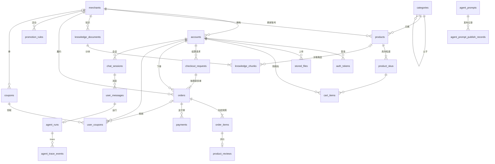

# 数据库迁移

## 规则

- 文件名 `NNNN_描述.sql`（4 位版本号 + 小写下划线描述），按版本号顺序执行，版本号不能重复。
- **已发布的迁移只追加、不修改**：每个已执行文件的 SHA-256 记录在 `schema_migrations.checksum`，启动时发现内容变化直接报错。要改表就新增下一个版本。
- 建表使用 `CREATE TABLE IF NOT EXISTS`：MySQL DDL 不支持事务，迁移中途失败后修正问题可以直接重跑。
- 多实例同时启动时用 MySQL 命名锁 `blink_shop_schema_migrations` 串行化，只有一个实例执行迁移。
- 数据库中存在代码不认识的版本（库比代码新）时拒绝启动。
- 不负责创建数据库本身；数据库需事先存在（本地由 Docker Compose 创建 `blink_shop`）。

执行时机：

| 场景 | 方式 |
| --- | --- |
| 本地开发 | `RUN_MIGRATIONS` 默认开启，API 启动后在后台执行（数据库暂不可用时每 5 秒重试）；`go run ./cmd/seed` 也会先迁移 |
| 生产 | `RUN_MIGRATIONS` 默认关闭，由显式的迁移任务执行（`RUN_MIGRATIONS=true` 启动一次） |

无论哪种方式，只要还有未执行的迁移，`/api/v1/ready` 就返回 503，不会有流量打到旧结构上。

## 迁移清单

| 版本 | 文件 | 内容 |
| --- | --- | --- |
| 0001 | `0001_init.sql` | 初始 24 张表：身份、目录、文件与知识、交易、营销与评价、导购会话、治理 |
| 0002 | `0002_promotion_discount_rate_check.sql` | `promotion_rules.discount_rate` 加 CHECK 约束，限定在 [0, 1]（REV-003） |

## 约定

- 主键为带前缀的字符串 ID（`acct_`、`p_`、`o_` 等，见 `src/domain/id.go`）。
- 时间列 `DATETIME(3)`，连接时强制会话时区 `+00:00`，全部按 UTC 存取。
- 金额 `DECIMAL(10,2)`，比例 `DECIMAL(5,4)`；应用层使用 `domain.Money` / `domain.Rate` 定点类型，不经过 float。比例的取值范围 [0, 1] 在解析、JSON 读入、数据库读出、写入数据库四个入口统一校验，数据库另有 CHECK 约束兜底。
- 无法写成 `IF NOT EXISTS` 的 `ALTER TABLE`，每个迁移文件只放一条，保证中途失败时不会只改了一半、也能直接重跑。
- JSON 列（标签、属性、附件、块等）读取后按目标结构解析，结构不符时返回带列名的错误。
- 不建外键（与上游一致，方便软删和分表）；引用完整性由业务事务和种子数据测试保证。

## 唯一约束（docs/02 不变量）

| 表 | 唯一键 | 作用 |
| --- | --- | --- |
| `accounts` | `username` | 用户名唯一，注销（软删）后也不复用 |
| `cart_items` | `(account_id, product_id, sku_id)` | 同一 SKU 在购物车中只有一行 |
| `checkout_requests` | `(account_id, idempotency_key)` | 重复结算返回首次结果 |
| `orders` | `order_no` | 订单号唯一 |
| `product_reviews` | `order_item_id` | 每个订单项只能评价一次 |
| `knowledge_documents` | `(merchant_id, content_hash)` | 同商家相同内容去重 |
| `knowledge_chunks` | `(document_id, chunk_index)` | 文档内分块序号唯一 |
| `user_messages` | `(account_id, session_id, client_message_id)` | 流式请求幂等 |
| `agent_runs` | `(account_id, message_id)` | 一条消息只运行一次 |
| `agent_prompts` | `(prompt_key, version)` | Prompt 版本唯一 |
| `product_skus` | `(product_id, sku_id)` | 库存粒度 |
| `stored_files` | `object_key` | 对象存储路径唯一 |

`auth_tokens` 只保存 token 的 SHA-256 摘要；`accounts.password_hash` 只保存 bcrypt 哈希。

## 实体关系

逻辑关系（无数据库外键）：

